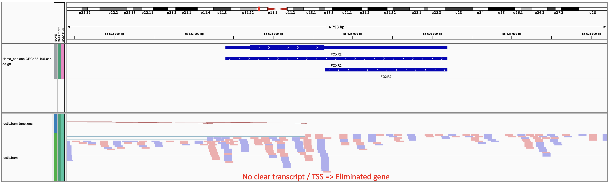

# Loading data and packages


```{r library, message = FALSE}
library(readxl)
library(readr)
library(CTexploreR)
library(tidyverse)
library(SummarizedExperiment)
library(ComplexHeatmap)
library(circlize)
library(SingleCellExperiment)
library(msigdbr)
library(DOSE)
library(org.Hs.eg.db)
library(clusterProfiler)
library(patchwork)
library(AUCell)
```


```{r load_data, warning=FALSE, message=FALSE}
load("../CTdata/eh_data/all_genes.rda")
load("../CTdata/eh_data/GTEX_data.rda")
load("../CTdata/eh_data/CCLE_data.rda")
load("../CTdata/eh_data/TCGA_TPM.rda")
load("../CTdata/eh_data/normal_tissues_multimapping_data.rda")
load("../CTdata/eh_data/mean_methylation_in_tissues.rda")
load("../CTdata/eh_data/DAC_treated_cells_multimapping.rda")
load("../CTdata/eh_data/DAC_treated_cells.rda")
load("../CTdata/eh_data/testis_sce.rda")
load("../CTdata/eh_data/FGC_sce.rda")
load("../CTdata/eh_data/oocytes_sce.rda")

load("../CTdata/eh_data/CT_genes.rda")


CT_genes_types <- CT_genes %>% 
  dplyr::rename(gene = external_gene_name) %>% 
  mutate(Regulation = case_when(regulated_by_methylation ~ "Methylation",
                                !regulated_by_methylation ~ 
                                  "Not methylation")) %>%
  mutate(Chr = case_when(X_linked ~ "X-linked",
                         !X_linked ~ "not X")) %>% 
  mutate(chr_met = case_when(regulated_by_methylation & X_linked ~ "X_met",
                             !regulated_by_methylation & X_linked ~ "X_not_met",
                             regulated_by_methylation & !X_linked ~ "not_X_met",
                             !regulated_by_methylation & !X_linked ~ 
                               "not_X_not_met")) %>% 
  mutate(specificity = case_when(GTEX_category == "testis_specific" ~ 
                                   "Testis specific",
                                 GTEX_category == "testis_preferential" ~ 
                                   "Testis preferential",
                                 GTEX_category == "lowly_expressed" ~ 
                                   "Undetectable in GTEX")) %>% 
  mutate(specificity = factor(specificity,
                              levels = c("Testis specific",  
                                         "Undetectable in GTEX", 
                                         "Testis preferential"))) %>% 
  mutate(chr_met = factor(chr_met, 
                          levels = c("X_met", "not_X_met", "X_not_met", 
                                     "not_X_not_met")))


all_genes_types <- all_genes %>% 
  dplyr::rename(gene = external_gene_name) %>% 
  mutate(Regulation = case_when(regulated_by_methylation ~ "Methylation",
                                !regulated_by_methylation ~ 
                                  "Not methylation")) %>%
  mutate(Chr = case_when(X_linked ~ "X-linked",
                         !X_linked ~ "not X")) %>% 
  mutate(chr_met = case_when(regulated_by_methylation & X_linked ~ "X_met",
                             !regulated_by_methylation & X_linked ~ "X_not_met",
                             regulated_by_methylation & !X_linked ~ "not_X_met",
                             !regulated_by_methylation & !X_linked ~ 
                               "not_X_not_met")) %>% 
  mutate(specificity = case_when(GTEX_category == "testis_specific" ~ 
                                   "Testis specific",
                                 GTEX_category == "testis_preferential" ~ 
                                   "Testis preferential",
                                 GTEX_category == "lowly_expressed" ~ 
                                   "Undetectable in GTEX")) %>% 
  mutate(specificity = factor(specificity,
                              levels = c("Testis specific",  
                                         "Undetectable in GTEX", 
                                         "Testis preferential"))) %>% 
  mutate(chr_met = factor(chr_met, 
                          levels = c("X_met", "not_X_met", "X_not_met", 
                                     "not_X_not_met")))

```


Common figures parameters

```{r fig_param}
legends_param <- list(
  labels_gp = gpar(col = "black", fontsize = 4),
  title_gp = gpar(col = "black", fontsize = 5, fontface = "bold"),
  simple_anno_size = unit(0.2, "cm"),
  row_names_gp = gpar(fontsize = 3),
  annotation_name_side = "left",
  border = FALSE,
  border_gp = gpar(lwd = 0.2),
  grid_width = unit(0.2, "cm"),
  grid_height = unit(0.05, "cm"),
  legend_height = unit(1, "cm"),
  use_raster = TRUE,
               raster_device = "CairoPNG",
               raster_quality = 10)


legend_colors <- c("#5E4FA2", "#3288BD", "#66C2A5", "#ABDDA4", "#E6F598",
                   "#FFFFBF", "#FEE08B", "#FDAE61", "#F46D43", "#D53E4F",
                   "#9E0142")

TCGA_colors <- c(
    "BRCA" = "midnightblue", "COAD" = "darkorchid2",
    "ESCA" = "gold", "HNSC" = "deeppink2",
    "LUAD" = "seagreen", "LUSC" = "seagreen3",
    "SKCM" = "red3")

CCLE_colors <- c(
    "Lung" = "seagreen3", "Skin" = "red3",
    "Bile_Duct" = "mediumpurple1", "Bladder" = "mistyrose2",
    "Colorectal" = "plum", "Lymphoma" = "steelblue1",
    "Uterine" = "darkorange4", "Myeloma" = "turquoise3",
    "Kidney" = "thistle4",
    "Pancreatic" = "darkmagenta", "Brain" = "palegreen2",
    "Gastric" = "wheat3", "Breast" = "midnightblue",
    "Bone" = "sienna1", "Head_and_Neck" = "deeppink2",
    "Ovarian" = "tan3", "Sarcoma" = "lightcoral",
    "Leukemia" = "steelblue4", "Esophageal" = "khaki",
    "Neuroblastoma" = "olivedrab1")

DAC_colors <- c(
    "B2-1" = "olivedrab2", "HCT116" = "lightcoral",
    "HEK293T" = "seagreen3", "HMLER" = "mediumpurple1",
    "IMR5-75" = "deeppink2", "NCH1681" = "steelblue2",
    "NCH612" = "red3", "TS603" = "darkmagenta")

DAC_treatment_colors <- c("CTL" = "royalblue4", "5-aza" = "maroon3")

Regulation_colors <- c("Methylation" = "indianred2", 
                       "Not methylation"= "cyan4")

chr_met_colors = c("X_met" = "mediumorchid2",
                   "X_not_met" = "mediumseagreen",
                   "not_X_met"= "darkorange1",
                   "not_X_not_met" = "dodgerblue1")

Chr_colors = c("X-linked" = "deeppink3", "not X" = "lightgreen")

Testis_specificity_colors = c("Testis specific" = "mediumpurple2",
                              "Testis preferential" = "goldenrod1",
                              "Undetectable in GTEX" = "gray")

testis_colors <- c(
    "SSC" = "floralwhite", "Spermatogonia" = "moccasin",
    "Early_spermatocyte" = "gold",
    "Late_spermatocyte" = "orange",
    "Round_spermatid" = "red2",
    "Elongated_spermatid" = "darkred", "Sperm" = "purple",
    "Sertoli" = "gray",
    "Leydig" = "cadetblue2", "Myoid" = "springgreen3",
    "Macrophage" = "gray10",
    "Endothelial" = "steelblue")

Fetal_cell_colors = c( "F_PGC" = "pink", 
                       "F_GC" = "pink3", 
                       "F_oogonia" = "palevioletred3",
                       "F_oocyte" = "mediumorchid4", 
                       "M_PGC" = "lightblue1", 
                       "M_GC" = "steelblue3",
                       "M_pre_spermatogonia" = "royalblue3")

oocytes_colors <- c("Growing oocytes" = "mediumpurple1",
                    # "Fully grown oocytes" ="lightgreen",
                     # "Metaphase I" = "mediumvioletred",
                    "Metaphase II" = "mediumpurple4")

sex_colors <- c("F" = "palevioletred1", "M"= "skyblue1")

stage_colors <- c( "pre-meiotic" = "peachpuff", 
                   "meiotic"= "lightsalmon",
                   "post-meiotic" = "maroon4",
                   "somatic" = "gray")

```

# CT selection

## Pipeline figure values

Here is the code used to have all the values in the pipeline figure.

As a reminder testis_specificity has been done summarizing testis-specificity 
analysis from GTEX, multimapping, HPA_cell_type_specificities, CCLE and TCGA 
categories.

Testis-specific genes must be: classified as "testis-specific" in GTEX or 
multimappig analysis +  must not be detected in any somatic cell type (in HPA 
scRNAseq analysis) + can not be classified as "leaky" in CLLE and TCGA 
categories + can not be detected (TPM > 0.5) in more than 75% of normal 
peritumoral tissues from a TCGA tumor type.

Testis_preferential genes must be: classified as "testis_preferential" in GTEX 
or multimappig analysis or initially classified as "testis-specific" in GTEX or 
multimappig analysis but downgraded to "testis_preferential because they were 
detected in a somatic cell type (in HPA scRNAseq analysis) + can be detected in 
some somatic cell type but the level has to be at least 10 times lower than the
level detected in a germ cell type (in HPA scRNAseq analysis) must not be 
classified as "leaky" in CLLE and TCGA categories.

```{r pipeline figures value}
table(all_genes$GTEX_category)
table(all_genes$multimapping_analysis)

table(all_genes$testis_specificity)
table(all_genes$GTEX_category, all_genes$testis_specificity)

specific_to_pref <- all_genes %>%
  filter(GTEX_category == "testis_specific" |
           multimapping_analysis == "testis_specific") %>% 
  filter(testis_specificity == "testis_preferential")
# No more specific to pref as their ratio are all < 10
# all_genes %>%
#   filter(GTEX_category == "testis_specific" |
#            multimapping_analysis == "testis_specific") %>% 
#   filter(!not_detected_in_somatic_HPA)

# Genes that were selected with GTEx but leaky so removed (ubiquitary expression)
all_genes %>% 
  filter(GTEX_category %in% c("testis_specific", "testis_preferential")) %>% 
  filter(TCGA_category == "leaky" | CCLE_category == "leaky") %>% 
  dim()

specific_to_none <- all_genes %>%
  filter(GTEX_category == "testis_specific" |
           multimapping_analysis == "testis_specific") %>% 
  filter(testis_specificity == "not_testis_specific")
table(specific_to_none$CCLE_category)
table(specific_to_none$TCGA_category)
table(specific_to_none$max_q75_in_NT < 0.5)
# 95 lost at this step
table(specific_to_none$not_detected_in_somatic_HPA)
table(specific_to_none$HPA_ratio_germ_som >= 10)

preferential_to_none <- all_genes %>%
  filter(GTEX_category == "testis_preferential" |
           multimapping_analysis == "testis_preferential") %>% 
  filter(testis_specificity == "not_testis_specific")
table(preferential_to_none$CCLE_category)
table(preferential_to_none$TCGA_category)
table(preferential_to_none$not_detected_in_somatic_HPA)
# Almost all detected in somatic
table(preferential_to_none$HPA_ratio_germ_som >= 10)


all_genes %>% 
  filter(testis_specificity != "not_testis_specific") %>% 
  filter(CCLE_category == "activated" & 
           (TCGA_category == "multimapping_issue" | 
              TCGA_category == "activated")) %>% 
  pull(testis_specificity) %>% 
  table()

table(all_genes$CT_gene_type) #Before and after TSS verif
```

## GTEX-TCGA-CCLE

Illustrate the selection using heatmaps with GTEx data, TCGA and CCLE

Function to print GTEX expression with specific annotations.

```{r GTEX_function}
print_GTEX_heatmap <- function(genes = NULL, units = "log_TPM", 
                               row_fontsize = 2,
                               column_fontsize = 6, 
                               h_width = 3,
                               h_height = 10,
                               split_rows_by = "regulation") {
  
  suppressMessages({
    database <- GTEX_data
  })
  
  database <- database[rowData(database)$external_gene_name %in% genes, ]
  
  mat <- assay(database)
  rownames(mat) <- rowData(database)$external_gene_name
  
  if (units == "log_TPM") mat <- log1p(mat)
    
  gene_type <- all_genes_types %>% 
    filter(gene %in% genes) 
   
   if (split_rows_by == "regulation") {
    gene_type <- gene_type %>% arrange(Regulation)
    rowSplit <- gene_type$Regulation
  }
  if (split_rows_by == "testis_specificity") {
    gene_type <- gene_type %>% arrange(Testis_specificity)
    rowSplit <- gene_type$Testis_specificity
  }
  if (split_rows_by == "chr_met") {
    gene_type <- gene_type %>% arrange(chr_met)
    rowSplit <- gene_type$chr_met
  }
  if (split_rows_by == "specificity") {
    gene_type <- gene_type %>% arrange(specificity)
    rowSplit <- gene_type$specificity
  }
  
  if (split_rows_by == "GTEX_category") {
    GTEX_category <- gene_type %>% arrange(GTEX_category)
    rowSplit <- gene_type$GTEX_category
  }
  
  Regulation <- as.matrix(gene_type$Regulation)
  rownames(Regulation) <- gene_type$gene
  row_ha_regulation <- rowAnnotation(Regulation = Regulation,
                                     annotation_legend_param = legends_param,
                                     simple_anno_size = unit(0.2, "cm"),
                                     col = list(Regulation = Regulation_colors),
                                     annotation_name_gp = gpar(fontsize = 0))
  
  chr_met <- as.matrix(gene_type$chr_met)
  rownames(chr_met) <- gene_type$gene
  row_ha_chr_met <- rowAnnotation(chr_met = chr_met,
                                  annotation_legend_param = legends_param,
                                  simple_anno_size = unit(0.2, "cm"),
                                  col = list(chr_met = chr_met_colors),
                                  annotation_name_gp = gpar(fontsize = 0))
  
  Chr <- as.matrix(gene_type$Chr)
  rownames(Chr) <- gene_type$gene
  row_ha_chr <- rowAnnotation(Chr = Chr,
                              annotation_legend_param = legends_param,
                              simple_anno_size = unit(0.2, "cm"),
                              col = list(Chr = Chr_colors),
                              annotation_name_gp = gpar(fontsize = 0))
  
  specificity <- as.matrix(gene_type$specificity)
  rownames(specificity) <- gene_type$gene
  row_ha_ts <- rowAnnotation(specificity = specificity,
                             annotation_legend_param = legends_param,
                             simple_anno_size = unit(0.2, "cm"),
                             col = list(specificity = 
                                          Testis_specificity_colors),
                             annotation_name_gp = gpar(fontsize = 0))
  
  heatmap_colors <- colorRamp2(
    seq(0, 5, length = 11),                 
    legend_colors)
  
  h <- Heatmap(mat[gene_type$gene, ],
               name = "log(TPM +1)",
               column_title = "Normal tissues (GTEx)",
               column_title_gp = gpar(fontsize = 6, face = "bold"),
               row_split = rowSplit,
               cluster_row_slices = FALSE,
               row_title_gp = gpar(fontsize = 4, face = "bold"),
               border = TRUE,
               border_gp = gpar(lwd = 0.5),
               col = heatmap_colors,
               cluster_rows = TRUE,
               cluster_columns = TRUE,
               show_row_dend = FALSE,
               show_column_dend = FALSE,
               row_names_gp = gpar(fontsize = row_fontsize),
               column_names_gp = gpar(fontsize = column_fontsize),
               column_names_side = "top",
               # right_annotation = c(row_ha_regulation, 
               #                        row_ha_chr, 
               #                        row_ha_ts,
               #                        gap = unit(1, "mm")),
               row_names_side = "left",
               width = unit(h_width, "cm"),
               height = unit(h_height, "cm"),
               clustering_method_rows = "ward.D",
               use_raster = TRUE,
               raster_device = "CairoPNG",
               raster_quality = 10,
               heatmap_legend_param = legends_param)
  
  return(h)
}
```

Function to print TCGA expression with specific annotations and to downsample 
the number of tumor samples per tumor type.

```{r TCGA_function}
print_TCGA_heatmap <- function(genes = NULL,
                               tum_type = c("TCGA-SKCM", "TCGA-LUAD", 
                                            "TCGA-LUSC", "TCGA-COAD", 
                                            "TCGA-BRCA", "TCGA-HNSC",
                                            "TCGA-ESCA"),
                               downsample_to_n = 450,
                               fontsize = 4, 
                               clust_method = "ward.D",
                               split_rows_by = "regulation", 
                               h_width = 5, 
                               h_height = 10,
                               clustRow = TRUE,
                               clustCol = TRUE) {
  
  tcga <- TCGA_TPM
  tcga <- tcga[,tcga$shortLetterCode != "NT"]
  
  ## downsample tumors to have the same number of tumors in each type
  TCGA <- tcga[, tcga$project_id == tum_type[1]]
  TCGA <- TCGA[, 1:min(ncol(TCGA), downsample_to_n)]
  
  for (tum in tum_type[-1]){
    tmp <- tcga[, tcga$project_id == tum]
    tmp <- tmp[, 1:min(ncol(tmp), downsample_to_n)]
    TCGA <- cbind(TCGA, tmp)
  }
  
  TCGA$project_id <- gsub(pattern = "TCGA-", x = TCGA$project_id, 
                          replacement = '')
  
  split_by <- factor(TCGA$project_id)
  
  column_ha_tumor <- HeatmapAnnotation(
    TCGA_tumor = TCGA$project_id,
    border = TRUE,
    col = list(TCGA_tumor = TCGA_colors),
    annotation_label = gpar(fontsize = 4),
    annotation_name_gp = gpar(fontsize = 0),
    simple_anno_size = unit(0.3, "cm"),
    annotation_legend_param = legends_param)
  
  ## Use gene names instead of ENSEMBL IDs
  mat <- SummarizedExperiment::assay(TCGA)
  rownames(mat) <- rowData(TCGA)$external_gene_name
  mat <- mat[rownames(mat) %in% all_genes$external_gene_name,]
  mat <- log1p(mat)
  
  gene_type <- all_genes_types %>% 
    filter(gene %in% genes) 
  
  rowSplit <- NULL
  if(!is.null(split_rows_by)){
   if (split_rows_by == "regulation") {
    gene_type <- gene_type %>% arrange(Regulation)
    rowSplit <- gene_type$Regulation
  }
  if (split_rows_by == "testis_specificity") {
    gene_type <- gene_type %>% arrange(Testis_specificity)
    rowSplit <- gene_type$testis_specificity
  }
  if (split_rows_by == "specificity") {
    gene_type <- gene_type %>% arrange(specificity)
    rowSplit <- gene_type$specificity
  }
    
  if (split_rows_by == "chr_met") {
    gene_type <- gene_type %>% arrange(chr_met)
    rowSplit <- gene_type$chr_met
  }
  
  if (split_rows_by == "GTEX_category") {
    GTEX_category <- gene_type %>% arrange(GTEX_category)
    rowSplit <- gene_type$GTEX_category
  }
  }
  
  Regulation <- as.matrix(gene_type$Regulation)
  rownames(Regulation) <- gene_type$gene
  row_ha_regulation <- rowAnnotation(Regulation = Regulation,
                                     annotation_legend_param = legends_param,
                                     simple_anno_size = unit(0.2, "cm"),
                                     col = list(Regulation = Regulation_colors),
                                     annotation_name_gp = gpar(fontsize = 0))
  
  chr_met <- as.matrix(gene_type$chr_met)
  rownames(chr_met) <- gene_type$gene
  row_ha_chr_met <- rowAnnotation(chr_met = chr_met,
                                  annotation_legend_param = legends_param,
                                  simple_anno_size = unit(0.2, "cm"),
                                  col = list(chr_met = chr_met_colors),
                                  annotation_name_gp = gpar(fontsize = 0))
  
  Chr <- as.matrix(gene_type$Chr)
  rownames(Chr) <- gene_type$gene
  row_ha_chr <- rowAnnotation(Chr = Chr,
                              annotation_legend_param = legends_param,
                              simple_anno_size = unit(0.2, "cm"),
                              col = list(Chr = Chr_colors),
                              annotation_name_gp = gpar(fontsize = 0))
  
  specificity <- as.matrix(gene_type$specificity)
  rownames(specificity) <- gene_type$gene
  row_ha_ts <- rowAnnotation(specificity = specificity,
                             annotation_legend_param = legends_param,
                             simple_anno_size = unit(0.2, "cm"),
                             col = list(specificity = 
                                          Testis_specificity_colors),
                             annotation_name_gp = gpar(fontsize = 0))
  
  # same range as in GTEX
  heatmap_colors <- colorRamp2(
    seq(0, 5, length = 11),                 
    legend_colors)
  
  Heatmap(mat[gene_type$gene, ],
          name = "TCGA (logTPM)",
          column_title = "TCGA tumor samples",
          column_title_gp = gpar(fontsize = 6, face = "bold"),
          clustering_method_rows = clust_method,
          clustering_method_columns = clust_method,
          column_split = split_by,
          row_gap = unit(c(1), "mm"),
          col = heatmap_colors,
          cluster_rows = clustRow,
          cluster_columns = clustCol,
          show_row_names = FALSE,
          show_column_names = FALSE,
          show_row_dend = FALSE,
          show_column_dend = FALSE,
          column_names_gp = gpar(fontsize = 6),
          column_names_centered = TRUE,
          row_names_gp = gpar(fontsize = 0),
          row_names_side = "left",
          border = TRUE,
          border_gp = gpar(lwd = 0.5),
          column_names_side = c("top"),
          column_names_rot = 90,
          row_title_gp = gpar(fontsize = 0),
          top_annotation = column_ha_tumor,
          right_annotation = c(row_ha_ts,
                               #row_ha_regulation,
                               #row_ha_chr,
                               gap = unit(1, "mm")),
          row_split = rowSplit,
          cluster_row_slices = FALSE,
          width = unit(h_width, "cm"),
          height = unit(h_height, "cm"),
          use_raster = TRUE,
          raster_device = "CairoPNG",
          raster_quality = 10,
          heatmap_legend_param = legends_param,
          show_heatmap_legend = FALSE)
}

```

Function to print CCLE expression with specific annotations. Allows to 
downsample the number of tumor samples pet tumor type to show

```{r CCLE_function}
print_CCLE_heatmap <- function(genes = NULL,
                               tum_type = c("Skin", "Lung", 
                                            "Colorectal", 
                                            "Breast", 
                                            "Head_and_Neck",
                                            "Esophageal"),
                               h_width = 5,
                               h_height = 10,
                               downsample_to_n = 450,
                               fontsize = 4, 
                               clust_method = "ward.D",
                               split_rows_by = "regulation", 
                               clustRow = TRUE,
                               clustCol = TRUE){
  
  ## downsample tumors to have the same number of tumors in each type
  ccle <- CCLE_data
  CCLE <- ccle[, ccle$type == tum_type[1]]
  CCLE <- CCLE[, 1:min(ncol(CCLE), downsample_to_n)]
  
  for (tum in tum_type[-1]){
    tmp <- ccle[, ccle$type == tum]
    tmp <- tmp[, 1:min(ncol(tmp), downsample_to_n)]
    CCLE <- cbind(CCLE, tmp)
  }
  
  split_by <- factor(CCLE$type)
  
  column_ha_tumor <- HeatmapAnnotation(
    CCLE_cell_type = CCLE$type,
    border = TRUE,
    col = list(CCLE_cell_type = CCLE_colors),
    annotation_label = gpar(fontsize = 4),
    annotation_name_gp = gpar(fontsize = 0),
    simple_anno_size = unit(0.3, "cm"),
    annotation_legend_param = legends_param)
  
  ## Use gene names instead of ENSEMBL IDs
  mat <- SummarizedExperiment::assay(CCLE)
  rownames(mat) <- rowData(CCLE)$external_gene_name
  mat <- mat[rownames(mat) %in% all_genes$external_gene_name, ]
  mat <- log1p(mat)
  
    
  gene_type <- all_genes_types %>% 
    filter(gene %in% genes) 
   
   if (split_rows_by == "regulation") {
    gene_type <- gene_type %>% arrange(Regulation)
    rowSplit <- gene_type$Regulation
  }
  if (split_rows_by == "testis_specificity") {
    gene_type <- gene_type %>% arrange(testis_specificity)
    rowSplit <- gene_type$testis_specificity
  }
  if (split_rows_by == "specificity") {
    gene_type <- gene_type %>% arrange(specificity)
    rowSplit <- gene_type$specificity
  }
  if (split_rows_by == "chr_met") {
    gene_type <- gene_type %>% arrange(chr_met)
    rowSplit <- gene_type$chr_met
  }
  
   if (split_rows_by == "GTEX_category") {
    GTEX_category <- gene_type %>% arrange(GTEX_category)
    rowSplit <- gene_type$GTEX_category
  }
  
  Regulation <- as.matrix(gene_type$Regulation)
  rownames(Regulation) <- gene_type$gene
  row_ha_regulation <- rowAnnotation(Regulation = Regulation,
                                     annotation_legend_param = legends_param,
                                     simple_anno_size = unit(0.2, "cm"),
                                     col = list(Regulation = Regulation_colors),
                                     annotation_name_gp = gpar(fontsize = 0))
  
  chr_met <- as.matrix(gene_type$chr_met)
  rownames(chr_met) <- gene_type$gene
  row_ha_chr_met <- rowAnnotation(chr_met = chr_met,
                                  annotation_legend_param = legends_param,
                                  simple_anno_size = unit(0.2, "cm"),
                                  col = list(chr_met = chr_met_colors),
                                  annotation_name_gp = gpar(fontsize = 0))
  
  Chr <- as.matrix(gene_type$Chr)
  rownames(Chr) <- gene_type$gene
  row_ha_chr <- rowAnnotation(Chr = Chr,
                              annotation_legend_param = legends_param,
                              simple_anno_size = unit(0.2, "cm"),
                              col = list(Chr = Chr_colors),
                              annotation_name_gp = gpar(fontsize = 0))
  
  specificity <- as.matrix(gene_type$specificity)
  rownames(specificity) <- gene_type$gene
  row_ha_ts <- rowAnnotation(specificity = specificity,
                                           annotation_legend_param = legends_param,
                                           simple_anno_size = unit(0.2, "cm"),
                                           col = list(specificity = 
                                                        Testis_specificity_colors),
                                           annotation_name_gp = gpar(fontsize = 0))
  
  # heatmap_colors <- colorRamp2(
  #   seq(0, quantile(rowMax(mat), 0.8), length = 11),                 
  #   legend_colors)
  
  # Same range as GTEX and TCGA
  heatmap_colors <- colorRamp2(
    seq(0, 5, length = 11),                 
    legend_colors)
  
  Heatmap(mat[gene_type$gene, ],
          name = "CCLE (logTPM)",
          column_title = paste0("CCLE tumor cell lines"),
          column_title_gp = gpar(fontsize = 6, face = "bold"),
          clustering_method_rows = clust_method,
          clustering_method_columns = clust_method,
          column_split = split_by,
          row_gap = unit(c(1), "mm"),
          col = heatmap_colors,
          cluster_rows = clustRow,
          cluster_columns = clustCol,
          show_row_names = TRUE,
          show_column_names = FALSE,
          show_row_dend = FALSE,
          show_column_dend = FALSE,
          column_names_gp = gpar(fontsize = 6),
          column_names_centered = TRUE,
          row_names_gp = gpar(fontsize = fontsize),
          row_names_side = "left",
          border = TRUE,
          border_gp = gpar(lwd = 0.5),
          column_names_side = c("top"),
          column_names_rot = 90,
          row_title_gp = gpar(fontsize = 0),
          top_annotation = column_ha_tumor,
          # right_annotation = c(row_ha_ts,
          #                      row_ha_regulation,
          #                      #row_ha_chr,
          #                      gap = unit(1, "mm")),
          row_split = rowSplit,
          width = unit(h_width, "cm"),
          height = unit(h_width, "cm"),
          use_raster = TRUE,
          raster_device = "CairoPNG",
          raster_quality = 10,
          heatmap_legend_param = legends_param,
          show_heatmap_legend = FALSE)
}
```

Show CT genes in GTEX, CCLE and TCGA (downsampling the number of samples by 
tumor type).

```{r selection_heatmap}
my_genes <- CT_genes %>% 
  pull(external_gene_name)

ht_TCGA <- print_TCGA_heatmap(my_genes, 
                              fontsize = 4, 
                              downsample_to_n = 50, 
                              h_width = 3,
                              h_height = 8,
                              tum_type = c("TCGA-SKCM", "TCGA-LUAD", 
                                           #"TCGA-ESCA", "TCGA-LUSC", 
                                           #"TCGA-COAD",
                                           #"TCGA-BRCA",
                                           "TCGA-HNSC"),
                              clust_method = "ward.D",
                              split_rows_by = "specificity")

ht_CCLE <- print_CCLE_heatmap(my_genes, 
                              downsample_to_n = 50, 
                              tum_type = c("Skin", "Lung", 
                                           #"colorectal", 
                                           #"breast", 
                                           #"esophageal",
                                           "Head_and_Neck"),
                              #"Leukemia", "Lymphoma"),
                              h_width = 3,
                              h_height = 8,
                              split_rows_by = "specificity")


ht_GTEX <- print_GTEX_heatmap(my_genes, 
                              row_fontsize = 1,
                              column_fontsize = 5,
                              h_width = 5,
                              h_height = 8,
                             split_rows_by = "specificity")
h_list <- ht_GTEX + ht_CCLE + ht_TCGA
draw(h_list, main_heatmap = "TCGA (logTPM)", ht_gap = unit(c(0.3, 0.01), "cm"),
     merge_legend = TRUE)
```

```{r, eval = FALSE, echo=FALSE}
pdf(file = paste0("figs/GTEX_Tumors.pdf"))
draw(h_list, main_heatmap = "TCGA (logTPM)", 
     ht_gap = unit(c(0.3, 0.01), "cm"),
     merge_legend = TRUE)
dev.off()
```

Counter examples

```{r counter_examples}
genes_not_testis <- all_genes %>% 
  filter(GTEX_category != "lowly_expressed") %>% 
  filter(testis_specificity == "not_testis_specific") %>% 
  pull(external_gene_name) %>% 
  sample(2)

genes_not_TCGA_activated <- all_genes %>% 
  filter(GTEX_category != "lowly_expressed") %>% 
  filter(testis_specificity != "not_testis_specific") %>% 
  filter(!TCGA_category %in% c("activated", "multimapping_issue")) %>% 
  pull(external_gene_name) %>% 
  sample(1)

genes_not_ccle_activated <- all_genes %>% 
  filter(GTEX_category != "lowly_expressed") %>% 
  filter(testis_specificity != "not_testis_specific") %>% 
  filter(CCLE_category %in% c("activated")) %>% 
  pull(external_gene_name) %>% 
  sample(1)

my_genes_counter <- c(genes_not_testis, genes_not_TCGA_activated, 
                      genes_not_ccle_activated)

ht_TCGA_counter <- print_TCGA_heatmap(my_genes_counter, 
                              fontsize = 4, 
                              downsample_to_n = 50, 
                              h_width = 3,
                              h_height = 8,
                              tum_type = c("TCGA-SKCM", "TCGA-LUAD",
                                           "TCGA-HNSC"),
                              clust_method = "ward.D",
                              split_rows_by = "specificity")

ht_CCLE_counter <- print_CCLE_heatmap(my_genes_counter, 
                              downsample_to_n = 50, 
                              tum_type = c("Skin", "Lung",
                                           "Head_and_Neck"),
                              h_width = 3,
                              h_height = 8,
                              split_rows_by = "specificity")


ht_GTEX_counter <- print_GTEX_heatmap(my_genes_counter, 
                              row_fontsize = 8,
                              column_fontsize = 5,
                              h_width = 5,
                              h_height = 8,
                             split_rows_by = "specificity")
h_list_counter<- ht_GTEX_counter + ht_CCLE_counter + ht_TCGA_counter
draw(h_list_counter, main_heatmap = "TCGA (logTPM)", ht_gap = unit(c(0.3, 0.01),
                                                                   "cm"),
     merge_legend = TRUE)


my_genes_leaky <-  all_genes %>% 
  filter(GTEX_category %in% c("testis_specific", "testis_preferential")) %>% 
  filter(TCGA_category == "leaky" | CCLE_category == "leaky") %>% 
   pull(external_gene_name) 
   

ht_TCGA_leaky <- print_TCGA_heatmap(my_genes_leaky, 
                              fontsize = 4, 
                              downsample_to_n = 50, 
                              h_width = 3,
                              h_height = 8,
                              tum_type = c("TCGA-SKCM", "TCGA-LUAD",
                                           "TCGA-HNSC"),
                              clust_method = "ward.D",
                              split_rows_by = "specificity")

ht_CCLE_leaky <- print_CCLE_heatmap(my_genes_leaky, 
                              downsample_to_n = 50, 
                              tum_type = c("Skin", "Lung",
                                           "Head_and_Neck"),
                              h_width = 3,
                              h_height = 8,
                              split_rows_by = "specificity")


ht_GTEX_leaky <- print_GTEX_heatmap(my_genes_leaky, 
                              row_fontsize = 8,
                              column_fontsize = 5,
                              h_width = 5,
                              h_height = 8,
                             split_rows_by = "specificity")
h_list_leaky<- ht_GTEX_leaky + ht_CCLE_leaky + ht_TCGA_leaky
draw(h_list_leaky, main_heatmap = "TCGA (logTPM)", ht_gap = unit(c(0.3, 0.01), "cm"),
     merge_legend = TRUE)
```


## Multimapping Fig

Figure showing how we kept the lowly_expressed in GTEx

```{r multimapping}
my_genes <- CT_genes %>% 
  filter(GTEX_category == 'lowly_expressed') %>% 
  filter(testis_specificity == "testis_specific")

without_MP <- log1p(
  assay(normal_tissues_multimapping_data[my_genes$ensembl_gene_id,], 
    "TPM_no_multimapping"))
with_MP <-  log1p(
  assay(normal_tissues_multimapping_data[my_genes$ensembl_gene_id,], 
    "TPM_with_multimapping"))
rownames(without_MP) <- rownames(with_MP) <- 
  rowData(normal_tissues_multimapping_data)[my_genes$ensembl_gene_id,]$external_gene_name

# Fix same range of colors for both heatmaps
full_mat <- cbind(without_MP, with_MP)
heatmap_colors <- colorRamp2(
  seq(0, quantile(rowMax(full_mat), 0.8), length = 11), legend_colors)

# Or same range of colors than GTEX heatmap
# heatmap_colors <- colorRamp2(
#   seq(0, 6, length = 11), legend_colors)

colnames(without_MP) <- gsub("_", x = str_to_sentence(colnames(without_MP)), ' ')
colnames(with_MP) <- gsub("_", x = str_to_sentence(colnames(with_MP)), ' ')
ordered_tissues <- 
  c("Testis", colnames(without_MP)[- which(colnames(without_MP) == "Testis")])
h_without_MP <- Heatmap(without_MP[my_genes$external_gene_name, ordered_tissues],
                        name = "no MP",
                        column_title = "Multimapped reads are excluded",
                        column_title_gp = gpar(fontsize = 10, face = "bold"),
                        border = TRUE,
                        border_gp = gpar(lwd = 0.5),
                        col = heatmap_colors,
                        cluster_rows = TRUE,
                        cluster_columns = FALSE,
                        show_row_dend = FALSE,
                        show_column_dend = FALSE,
                        row_names_gp = gpar(fontsize = 4),
                        column_names_gp = gpar(fontsize = 6),
                        column_names_side = "top",
                        row_names_side = "left",
                        heatmap_width = unit(8, "cm"),
                        heatmap_height = unit(12, "cm"),
                        clustering_method_rows = "ward.D",
                        use_raster = TRUE,
                        raster_device = "CairoPNG",
                        raster_quality = 10,
                        show_heatmap_legend = FALSE,
                        heatmap_legend_param = legends_param)

h_with_MP <- Heatmap(with_MP[my_genes$external_gene_name, ordered_tissues],
                     name = "log(TPM)",
                     column_title = "Multimapped reads are counted",
                     column_title_gp = gpar(fontsize = 10, face = "bold"),
                     border = TRUE,
                     border_gp = gpar(lwd = 0.5),
                     col = heatmap_colors,
                     cluster_rows = TRUE,
                     cluster_columns = FALSE,
                     show_row_dend = FALSE,
                     show_column_dend = FALSE,
                     row_names_gp = gpar(fontsize = 4),
                     column_names_gp = gpar(fontsize = 6),
                     column_names_side = "top",
                     row_names_side = "left",
                     heatmap_width = unit(8, "cm"),
                     heatmap_height = unit(12, "cm"),
                     clustering_method_rows = "ward.D",
                     use_raster = TRUE,
                     raster_device = "CairoPNG",
                     raster_quality = 10,
                     heatmap_legend_param = legends_param)

h_list <- h_without_MP + h_with_MP
draw(h_list, main_heatmap = "log(TPM)", ht_gap = unit(0.3, "cm"),
                 height = unit(5, "cm"))
```

```{r, eval = FALSE, echo = FALSE}
pdf(file = paste0("figs/Multimapping.pdf"))
draw(h_list, main_heatmap = "log(TPM)", ht_gap = unit(0.3, "cm"),
                 height = unit(5, "cm"))
dev.off()
```

## IGV

Shows why we removed illegitimate transcripts

```{r, echo=FALSE, fig.align='left', out.width = '100%', purl = TRUE}

```

# CT_genes specific

From now on, we'll focus on CT genes that are specific

```{r}
CT_genes <- CT_genes %>%
  filter(CT_gene_type == "CT_gene") 
CT_genes_types <- CT_genes_types %>% 
  filter(CT_gene_type == "CT_gene")
```


# Methylation analysis

## Regulation by methylation

```{r meth_heatmap_function}
met_genes <- CT_genes %>% 
  filter(regulated_by_methylation) %>% 
  pull(external_gene_name)
met_value_number_per_gene <- tibble(
  gene = CT_genes$external_gene_name,
  regulated_by_methylation = CT_genes$regulated_by_methylation,
  NA_met_values_number = rowSums(
    is.na(assay(mean_methylation_in_tissues[CT_genes$external_gene_name, ]))))
n_met_values <- ncol(mean_methylation_in_tissues)
CT_met_with_WGBS <- met_value_number_per_gene %>%
  filter(regulated_by_methylation) %>% 
  filter(NA_met_values_number !=  n_met_values)

CT_met_without_WGBS <- met_value_number_per_gene %>%
  filter(regulated_by_methylation) %>% 
  filter(NA_met_values_number == n_met_values )

CT_not_met_with_WGBS <- met_value_number_per_gene %>%
  filter(!regulated_by_methylation) %>% 
  filter(NA_met_values_number !=  n_met_values)

CT_not_met_without_WGBS <- met_value_number_per_gene %>%
  filter(!regulated_by_methylation) %>% 
  filter(NA_met_values_number == n_met_values )

mean_methylation_fig <- function(genes = NULL, 
                                 values_only = FALSE,
                                 row_fontsize = 4,
                                 column_fontsize = 8, 
                                 na.omit = FALSE) {
  
  database <- mean_methylation_in_tissues
  rowData(database)$external_gene_name <- rownames(database)
  database <- database[genes, ]
  
  if (na.omit) {
    mat <- na.omit(assay(database))
    clustering_option <- TRUE
  } else {
    mat <- assay(database)
    clustering_option <- FALSE
  }
  
  gene_type <- CT_genes_types %>% 
    filter(gene %in% genes) %>% 
    mutate(group = case_when(gene %in% CT_met_with_WGBS$gene ~ "group1",
                             gene %in% CT_met_without_WGBS$gene ~ "group2",
                             gene %in% CT_not_met_with_WGBS$gene ~ "group3",
                             gene %in% CT_not_met_without_WGBS$gene ~ "group4")) %>% 
    left_join(CT_genes %>% dplyr::rename(gene = external_gene_name) %>% 
                dplyr::select(gene, somatic_met_level, sperm_met_level, 
                              germline_methylation, somatic_methylation)) %>% 
    arrange(group, sperm_met_level)

  # sort genes regulated by met differently than not regulated by met
  gene_type_met <- gene_type %>%
    filter(regulated_by_methylation) 
    
  gene_type_not_met <- gene_type %>%
    filter(!regulated_by_methylation) %>%
    arrange(germline_methylation, somatic_met_level)

  gene_type <- rbind(gene_type_met, gene_type_not_met)
  colnames(mat) <- str_to_sentence(colnames(mat))
  
  h <- Heatmap(mat[gene_type$gene, sort(colnames(mat))],
               column_title = "Promoter methylation",
               name = "Mean \nmethylation",
               column_title_gp = gpar(fontsize = 6),
               border = TRUE,
               border_gp = gpar(lwd = 0.5),
               row_title_gp = gpar(col = c("indianred2", "cyan4"), fontsize = 8),
               row_split = factor(gene_type$Regulation,
                                  levels = c("Methylation", "Not methylation")),
               #row_split = factor(gene_type$group),
               cluster_row_slices = FALSE,
               col = colorRamp2(seq_len(100),
                                colorRampPalette(c("moccasin", "dodgerblue4"))(100)),
               na_col = "gray80",
               cluster_rows = FALSE,
               cluster_columns = FALSE,
               show_row_names = TRUE,
               show_heatmap_legend = TRUE,
               show_row_dend = FALSE,
               column_names_gp = gpar(fontsize = column_fontsize),
               row_names_gp = gpar(fontsize = row_fontsize),
               row_names_side = "left",
               heatmap_width = unit(4, "cm"),
               heatmap_height = unit(10, "cm"),
               use_raster = TRUE,
               raster_device = "CairoPNG",
               raster_quality = 8,
               column_names_side = "top",
               heatmap_legend_param = legends_param)
  
  return(h)
}
```

```{r DAC_heatmap_function}
DAC_fig <- function(genes = gene_type$gene, multimapping = TRUE, 
                    row_fontsize = 2,
                    units = "log1p",
                    values_only = FALSE, scale_lims = NULL) {
  

  if (multimapping) {
    # database <- CTdata::DAC_treated_cells_multimapping()
    database <- DAC_treated_cells_multimapping
    
  } else {
    #database <- CTdata::DAC_treated_cells()
    database <- DAC_treated_cells
  }
  
  database$treatment[database$treatment == "DAC"] <- "5-aza"
  database$treatment <- factor(database$treatment, levels = c("CTL", "5-aza"))
   gene_type <- CT_genes_types %>% 
    filter(gene %in% genes) %>% 
    mutate(group = case_when(gene %in% CT_met_with_WGBS$gene ~ "group1",
                             gene %in% CT_met_without_WGBS$gene ~ "group2",
                             gene %in% CT_not_met_with_WGBS$gene ~ "group3",
                             gene %in% CT_not_met_without_WGBS$gene ~ "group4")) %>% 
    left_join(CT_genes %>% dplyr::rename(gene = external_gene_name) %>% 
                dplyr::select(gene, somatic_met_level, sperm_met_level, 
                              germline_methylation, somatic_methylation)) %>% 
    arrange(group, sperm_met_level)

  # sort genes regulated by met differently than not regulated by met
  gene_type_met <- gene_type %>%
    filter(regulated_by_methylation) 
    
  gene_type_not_met <- gene_type %>%
    filter(!regulated_by_methylation) %>%
    arrange(germline_methylation, somatic_met_level)

  gene_type <- rbind(gene_type_met, gene_type_not_met)
  rownames(database) <- rowData(database)$external_gene_name
  
  mat <- assay(database, units)
  
  df_col <- data.frame("cell" = colData(database)$cell,
                       "treatment" = colData(database)$treatment)
  rownames(df_col) <- rownames(colData(database))
  df_col <- df_col[order(df_col$cell, df_col$treatment), ]
  
  column_ha_cell <- HeatmapAnnotation(
    cell = df_col$cell,
    border = FALSE, 
    #border_gp = gpar(lwd = 0.1),
    simple_anno_size = unit(0.2, "cm"),
    annotation_legend_param = legends_param,
    col = list("cell" = DAC_colors),
    annotation_name_gp = gpar(fontsize = 0))  
  
  column_ha_treatment <- HeatmapAnnotation(
    treatment = df_col$treatment,
    col = list(treatment = DAC_treatment_colors),
    annotation_legend_param = legends_param,
    border = FALSE, 
    simple_anno_size = unit(0.2, "cm"),
    annotation_name_gp = gpar(fontsize = 0))  
  
  Regulation <- as.matrix(gene_type$Regulation)
  rownames(Regulation) <- gene_type$gene
  row_ha_regulation <- rowAnnotation(Regulation = Regulation,
                                     annotation_legend_param = legends_param,
                                     simple_anno_size = unit(0.2, "cm"),
                                     col = list(Regulation = Regulation_colors),
                                     annotation_name_gp = gpar(fontsize = 0))
  
  chr_met <- as.matrix(gene_type$chr_met)
  rownames(chr_met) <- gene_type$gene
  row_ha_chr_met <- rowAnnotation(chr_met = chr_met,
                                  annotation_legend_param = legends_param,
                                  simple_anno_size = unit(0.2, "cm"),
                                  col = list(chr_met = chr_met_colors),
                                  annotation_name_gp = gpar(fontsize = 0))
  
  Chr <- as.matrix(gene_type$Chr)
  rownames(Chr) <- gene_type$gene
  row_ha_chr <- rowAnnotation(Chr = Chr,
                              annotation_legend_param = legends_param,
                              simple_anno_size = unit(0.2, "cm"),
                              col = list(Chr = Chr_colors),
                              annotation_name_gp = gpar(fontsize = 0))
  
  specificity <- as.matrix(gene_type$specificity)
  rownames(specificity) <- gene_type$gene
  row_ha_ts <- rowAnnotation(specificity = specificity,
                             annotation_legend_param = legends_param,
                             simple_anno_size = unit(0.2, "cm"),
                             col = list(specificity = 
                                          Testis_specificity_colors),
                             annotation_name_gp = gpar(fontsize = 0))
  if (is.null(scale_lims)) scale_lims <- c(0, quantile(rowMaxs(mat), 0.75))
  
  h <- Heatmap(mat[gene_type$gene, rownames(df_col), drop = FALSE],
               name = "logCounts",
               row_split = factor(gene_type$Regulation, 
                                  levels = c("Methylation", "Not methylation")),
               row_title_gp = gpar(col = Regulation_colors, fontsize = 6),
               border = TRUE,
               border_gp = gpar(lwd = 0.5),
               column_title = "Expression in cells treated with 5-Aza",
               column_title_gp = gpar(fontsize = 6),
               column_split = factor(df_col$cell),
               col = colorRamp2(seq(scale_lims[1], scale_lims[2], length = 11),
                                legend_colors),
               cluster_rows = TRUE,
               show_row_dend = FALSE,
               show_row_names = FALSE,
               clustering_method_rows = "ward.D",
               show_column_names = FALSE,
               cluster_columns = FALSE,
               row_names_gp = gpar(fontsize = row_fontsize),
               top_annotation = c(column_ha_cell, column_ha_treatment),
               # right_annotation = c(row_ha_ts,
               #                      #row_ha_regulation,
               #                      row_ha_chr,
               #                      gap = unit(1, "mm")),
               heatmap_width = unit(6, "cm"),
               heatmap_height = unit(10, "cm"),
               use_raster = TRUE,
               raster_device = "CairoPNG",
               raster_quality = 10,
               heatmap_legend_param = legends_param)
  
  return(h)
}
```

```{r draw_meth_reg}
fs <- 1.2
h_met <- mean_methylation_fig(genes = CT_genes$external_gene_name,
                              values_only = FALSE,
                              row_fontsize = fs,
                              column_fontsize = 5,
                              na.omit = FALSE)

h_DAC <- DAC_fig(CT_genes$external_gene_name, 
                 multimapping = TRUE, 
                 units = "log1p",
                 row_fontsize = fs)
                 

h_list <- h_met + h_DAC 
draw(h_list, main_heatmap = "Mean \nmethylation", ht_gap = unit(0.5, "cm"), 
     merge_legend = TRUE)
```

```{r, eval = FALSE, echo = FALSE}
pdf(file = paste0("figs/Methylation_classification.pdf"))
draw(h_list, main_heatmap = "Mean \nmethylation", ht_gap = unit(0.5, "cm"), 
     merge_legend = TRUE)
dev.off()
```

## Proportion of methylation regulated

```{r prop_meth}
x <- enframe(table(CT_genes_types$Regulation), name = "Regulation") %>% 
  left_join(enframe(prop.table(table(CT_genes_types$Regulation)), 
                    name = "Regulation", value = "Percent"))
met_prop_fig <- ggplot(x, aes(x = '', y = value, fill = Regulation)) +
  geom_bar(stat="identity", width=1) +
  coord_polar("y", start = 0) +
  geom_text(aes(y = value/5 + c(0, cumsum(value)[-length(value)]), 
                label = rev(paste0(Regulation, "\n", value, "/", 
                                   sum(table(CT_genes_types$Regulation)), "\n",
                               round(Percent * 100), "%"))))+
            #, size = 6
  scale_fill_manual(values = c( "indianred2", "cyan4")) +
  theme(axis.title.x = element_blank(),
        axis.title.y = element_blank(),
        legend.title = element_blank(),
        panel.background = element_blank(),
        panel.border = element_blank(),
        panel.grid = element_blank(),
        axis.ticks = element_blank(),
        axis.text.x = element_blank(),
        legend.position = "none")
met_prop_fig
```

```{r, eval = F}
pdf(file = paste0("figs/Met_proportions.pdf"))
met_prop_fig
dev.off()
```

## Enrichment on X chromosome

Genes regulated by methylation are enriched on the X chromosome.

```{r}
CT_genes_types$chr <- factor(CT_genes_types$chr, levels = c(1:22, "X", "Y"))

fig_X_enrichment <- ggplot(CT_genes_types[
  !is.na(CT_genes_types$regulated_by_methylation), ], 
                           aes(x = chr, fill = Regulation)) +
  geom_bar(stat = 'count') +
  xlab("Chromosome") +
  ylab("Gene number") +
  scale_fill_manual(values = Regulation_colors) +
  theme(legend.position = "bottom",
        aspect.ratio = 1)
fig_X_enrichment
```


```{r, eval = FALSE, echo=FALSE}
pdf(file = paste0("figs/X_enrichment.pdf"), width = 7, height = 4)
cowplot::plot_grid(met_prop_fig, fig_X_enrichment, labels = c('A', 'B'), 
          rel_widths = c(1, 2),
          label_size = 12)
dev.off()
```

Genes are enriched on the X chromosome 
(`r table(CT_genes$X_linked)[[2]]/dim(CT_genes)[1]*100`%). Also, 
`r table(CT_genes$regulated_by_methylation)[[2]]` genes have been flagged as 
regulated by methylation 
(`r table(CT_genes$regulated_by_methylation)[[2]]/dim(CT_genes)[1]*100`%). 
It is interesting to study the link between these two characteristics.

On the chromosome X, there is a clear enrichment of CT genes regulated by 
methylation (`r table(CT_genes$X_linked, CT_genes$regulated_by_methylation)[2, 2]`
/`r table(CT_genes$X_linked)[[2]]` chrX genes or 
`r table(CT_genes$X_linked, CT_genes$regulated_by_methylation)[2, 2]`/
`r table(CT_genes$regulated_by_methylation)[[2]]` genes regulated by 
methylation).


This has to be checked with stats

```{r meth_stats}
CT_genes_types <- CT_genes_types %>% 
  mutate(group = case_when(chr == "X" ~ "X-linked",
                           chr == "Y" ~ "Y-linked",
                           !chr %in% c("X", "Y") ~ "Autosome"))

x <- table(CT_genes_types$group, CT_genes_types$Regulation)
x
fisher.test(x[c("Autosome", "X-linked"),])
fisher.test(x[c("Autosome", "Y-linked"),])

chisq.test(x[c("Autosome", "X-linked"),])
chisq.test(x[c("Autosome", "Y-linked"),])
```

Genes controlled by methylation are significantly enriched on the X


## Put figs together

Putting the figs on the same panel with a bit of fine tuning

```{r meth_figs}
x <- enframe(table(CT_genes_types$Regulation), name = "Regulation") %>% 
  left_join(enframe(prop.table(table(CT_genes_types$Regulation)), 
                    name = "Regulation", value = "Percent"))
prop_fig <- ggplot(x, aes(x = '', y = value, fill = Regulation)) +
  geom_bar(stat="identity", width = 1) +
  coord_polar("y", start = 0) +
  geom_text(aes(y = value/5 + c(0, cumsum(value)[-length(value)]),
                label = rev(paste0(Regulation, "\n", value, "/", 
                                   sum(table(CT_genes_types$Regulation)), "\n",
                               round(Percent * 100), "%"))), size = 1.2 )+
  scale_fill_manual(values = Regulation_colors) +
  theme(axis.title.x = element_blank(),
        axis.title.y = element_blank(),
        legend.title = element_blank(),
        panel.background = element_blank(),
        panel.border = element_blank(),
        panel.grid = element_blank(),
        axis.ticks = element_blank(),
        axis.text.x = element_blank(),
        legend.position = "none")


fig_freq_by_chr <- ggplot(CT_genes_types[
  !is.na(CT_genes_types$regulated_by_methylation), ], 
  aes(x = chr, fill = Regulation)) +
  geom_bar(stat = 'count') +
  xlab("Chromosome") +
  ylab("Gene number") +
  scale_fill_manual(values = Regulation_colors) +
  theme_test()+
  theme(legend.position = "top",
        aspect.ratio = 1,
        axis.text = element_text(size = 3),
        axis.title = element_text(size = 5),
        axis.ticks = element_line(linewidth = 0.2),
        axis.ticks.length = unit(0.5, "mm"),
        legend.text = element_text(size = 5),
        legend.key.size = unit(2, "mm"),
        legend.title = element_blank())


right_fig <- cowplot::plot_grid(prop_fig, fig_freq_by_chr, labels = c('B', 'C'), 
                                #hjust = -2, 
                                vjust = 1,
                                #scale = c(0.8, 1), 
                                rel_heights = c(0.5, 1),
                                ncol = 1)

left_fig <- cowplot::plot_grid(grid.grabExpr(
  draw(h_list, main_heatmap = "Mean \nmethylation", ht_gap = unit(0.3, "cm"), 
       merge_legend = TRUE)), labels = c('A'))


cowplot::plot_grid(left_fig, right_fig, 
          rel_widths = c(2,1),
          #scale = c(0.6, 0.5),
          label_size = 10, nrow = 1, 
          #align = "h", 
          align = "vh")
```


```{r, eval = FALSE, echo = FALSE}
pdf(file = paste0("figs/Methylation_panel.pdf"), width = 7, height = 4)
cowplot::plot_grid(left_fig, right_fig, 
          rel_widths = c(2,1),
          scale = c(1, 0.8),
          label_size = 10, nrow = 1,
          align = "h")
dev.off()
```

# Gene biotype

Mainly protein-coding genes
Most genes are mainly protein coding genes 
(`r table(CT_genes$transcript_biotype)["protein_coding"]/dim(CT_genes)[1]*100`%).

```{r biotype}
prop.table(table(CT_genes$transcript_biotype))
```


Gene biotype / regulation

```{r biotype_reg}
prop.table(table(methylation = CT_genes$regulated_by_methylation,
                 CT_genes$transcript_biotype))


prop.table(table(CT_genes$transcript_biotype,
                 methylation = CT_genes$regulated_by_methylation))
```

# CT genes in tumour : coexpression and link with global hypomethylation

## Positive tumour proportion and expression level

CT genes regulated by methylation are activated more frequently and at higher 
levels

```{r pos_tum_exprs}
TCGA <- TCGA_TPM
TCGA <- TCGA[, TCGA$shortLetterCode != "NT"]

tumors <- unique(TCGA$project_id)

thr_pos <- 1

prop_of_pos_tum <- as_tibble(assay(TCGA), rownames = "ensembl_gene_id") %>% 
  filter(ensembl_gene_id %in% CT_genes$ensembl_gene_id) %>% 
  pivot_longer(names_to = "barcode", values_to = "TPM", -ensembl_gene_id) %>% 
  mutate(activated = ifelse(TPM > thr_pos, "n_pos", "n_neg")) %>% 
  group_by(ensembl_gene_id, activated) %>% 
  dplyr::summarize(n = n()) %>% 
  pivot_wider(names_from = activated, values_from = n) %>% 
  mutate(proportion_of_positive_tum = n_pos * 100 / (n_pos + n_neg)) 

mean_in_pos <- as_tibble(assay(TCGA), rownames = "ensembl_gene_id") %>% 
  filter(ensembl_gene_id %in% CT_genes$ensembl_gene_id) %>%  
  pivot_longer(names_to = "barcode", values_to = "TPM", -ensembl_gene_id) %>% 
  mutate(activated = ifelse(TPM > thr_pos, "n_pos", "n_neg")) %>% 
  filter(activated == "n_pos") %>% 
  group_by(ensembl_gene_id) %>% 
  summarise(mean_log = log1p(mean(TPM)),
            mean_TPM = mean(TPM)) 

mean_and_prop_TCGA <- prop_of_pos_tum %>% 
  left_join(mean_in_pos) %>% 
  right_join(CT_genes_types) %>% 
  dplyr::select(gene, mean_log, proportion_of_positive_tum, 
                Regulation, X_linked) %>% 
  mutate(source = "TCGA tumor samples")

# combine with CCLE data
ccle <- CCLE_data
tumors <- unique(ccle$primary_disease)

prop_of_pos_tum <- as_tibble(assay(ccle), rownames = "ensembl_gene_id") %>% 
  filter(ensembl_gene_id %in% CT_genes$ensembl_gene_id) %>%  
  pivot_longer(names_to = "cell", values_to = "TPM", -ensembl_gene_id) %>% 
  mutate(activated = ifelse(TPM > thr_pos, "n_pos", "n_neg")) %>% 
  group_by(ensembl_gene_id, activated) %>% 
  dplyr::summarize(n = n()) %>% 
  pivot_wider(names_from = activated, values_from = n) %>% 
  mutate(proportion_of_positive_tum = n_pos * 100 / (n_pos + n_neg)) 

mean_in_pos <- as_tibble(assay(ccle), rownames = "ensembl_gene_id") %>% 
  filter(ensembl_gene_id %in% CT_genes$ensembl_gene_id) %>%   
  pivot_longer(names_to = "cell", values_to = "TPM", -ensembl_gene_id) %>% 
  mutate(activated = ifelse(TPM > thr_pos, "n_pos", "n_neg")) %>% 
  filter(activated == "n_pos") %>% 
  group_by(ensembl_gene_id) %>% 
  summarise(mean_log = log1p(mean(TPM)),
            mean_TPM = mean(TPM)) 

mean_and_prop_CCLE <- prop_of_pos_tum %>% 
  left_join(mean_in_pos) %>% 
  right_join(CT_genes_types) %>% 
  dplyr::select(gene, mean_log, proportion_of_positive_tum, Regulation, X_linked) %>% 
  mutate(source = "CCLE tumor cell lines")

mean_and_prop <- rbind(mean_and_prop_TCGA, mean_and_prop_CCLE)

labelled_genes <- mean_and_prop %>% 
  filter(proportion_of_positive_tum > 22 | mean_log > 4)
mean_and_prop$source <- factor(mean_and_prop$source, 
                               levels = c("TCGA tumor samples", "CCLE tumor cell lines"))

fig_mean_prop_in_tum <- ggplot(mean_and_prop[!is.na(mean_and_prop$Regulation), ],
                               aes(x = mean_log, y = proportion_of_positive_tum,
                                   shape = X_linked,
                                   color = Regulation,
                                   label = gene)) +
  geom_point(size = 1) +
  scale_colour_manual(values = Regulation_colors)+
  ggrepel::geom_text_repel(
    data = mean_and_prop %>% 
      filter(proportion_of_positive_tum > 20 | 
               (proportion_of_positive_tum > 5 & mean_log > 4)), 
    aes(x = mean_log, y = proportion_of_positive_tum, 
        label = gene), size = 1.5, color = "black", min.segment.length = 1,
    max.overlaps = 30, direction = "both") +
  xlab("Mean expression log(TPM + 1)\nin positive samples") +
  ylab("Proportion of positive samples (%)") +
  facet_wrap(~ source, ncol = 2) +
  theme_bw() +
  theme(legend.position = "right",
        aspect.ratio = 0.8,
        panel.grid.major = element_blank(),
        panel.grid.minor = element_blank(),
        legend.key.size = unit(0.3, 'cm'),
        legend.text = element_text(size = 6),
        legend.title = element_text(size = 7),
        axis.text = element_text(size = 5),
        axis.ticks = element_line(size = 0.1),
        axis.title = element_text(size = 6),
        strip.text = element_text(size = 6))

fig_mean_prop_in_tum
```
```{r, eval = FALSE, echo = FALSE}
pdf(file = paste0("figs/Mean_prop_in_tumors.pdf"), width = 5, height = 4)
fig_mean_prop_in_tum
dev.off()
```


## Activation in TCGA, coexpression and global hypomethylation

```{r AUC_score}
keep <- rowSums(assay(TCGA)) > 0
TCGA <- TCGA[keep, ]
TCGA$project_id <- gsub("TCGA-", '', TCGA$project_id)

cells_rankings <- suppressMessages(AUCell_buildRankings(assay(TCGA), 
                                                        plotStats = TRUE, 
                                                        verbose = FALSE))
geneSetsMet <- list(methylation = CT_genes_types %>% 
                      filter(Regulation == "Methylation") %>%  
                      filter(ensembl_gene_id %in% rownames(TCGA)) %>% 
                      pull(ensembl_gene_id),
                    not_methylation = CT_genes_types %>% 
                      filter(Regulation == "Not methylation") %>%  
                      filter(ensembl_gene_id %in% rownames(TCGA)) %>% 
                      pull(ensembl_gene_id))


# Calculate enrichment scores
cells_AUC_met <- AUCell_calcAUC(geneSetsMet, 
                            cells_rankings, 
                            aucMaxRank = ceiling(0.2 * nrow(cells_rankings)))

TCGA$AUC_genes_regulated_by_met <- as.vector(assay(cells_AUC_met)["methylation", ])
TCGA$AUC_genes_not_regulated_by_met <- as.vector(assay(cells_AUC_met)["not_methylation", ])
```

- Show One heatmap for CT-met with AUScores and Global hypo levels

- Show another one with CT-notMet (low coexpression, no pattern, 
uncorrelated with global hypo)

Plotted on the heatmaps genes that have a TPM > 0 in at least 5% of tumor samples

```{r TCGA_heatmap}
legends_param_TCGA <- list(
  labels_gp = gpar(col = "black", fontsize = 2),
  title_gp = gpar(col = "black", fontsize = 3),
  simple_anno_size = unit(0.1, "cm"),
  row_names_gp = gpar(fontsize = 1),
  annotation_name_side = "left",
  border = FALSE,
  border_gp = gpar(lwd = 0.1),
  grid_width = unit(0.05, "cm"),
  grid_height = unit(0.1, "cm"),
  legend_height = unit(0.01, "cm"),
  direction = "horizontal",
  use_raster = TRUE,
               raster_device = "CairoPNG",
               raster_quality = 10)

print_TCGA_heatmap_with_AUCscores <- function(genes = NULL,
                                              tum_type = c("SKCM", "LUAD", 
                                                           "LUSC", "COAD", 
                                                           "BRCA", "HNSC"),
                                              AUScores = "AUC_genes_met", 
                                              scale_lims = NULL,
                                              show_AUScore = TRUE,
                                              fontsize = 4, 
                                              clust_method = "ward.D",
                                              split_rows_by = "regulation", 
                                              h_width = 7,
                                              h_height = 5,
                                              clustRow = TRUE,
                                              clustCol = FALSE){
  
  tcga <- TCGA[, TCGA$project_id %in% tum_type & !is.na(TCGA$global_methylation)]
  tcga$project_id <- factor(tcga$project_id , levels = tum_type)
  
  # Rm genes expressed in less than 5% of tumors
  keep <- (rowSums(assay(tcga) > 0) / dim(tcga)[2]) > 0.05
  tcga <- tcga[keep,]
  
  df_col <- data.frame("project_id" = tcga$project_id,
                       "AUScore" = tcga$AUC_genes_regulated_by_met,
                       "global_methylation" = tcga$global_methylation,
                       "gender" = tcga$gender)
  
  if (AUScores == "AUC_genes_not_met") {
    df_col <- data.frame("project_id" = tcga$project_id,
                         "AUScore" = tcga$AUC_genes_not_regulated_by_met,
                         "global_methylation" = tcga$global_methylation,
                         "gender" = tcga$gender)
  }
  
  rownames(df_col) <- rownames(colData(tcga))
  df_col <- df_col[!is.na(df_col$global_methylation),]
  df_col <- df_col[order(df_col$project_id, df_col$AUScore), ]
  #  df_col <- df_col[order(df_col$project_id), ]
  split_by <- factor(df_col$project_id)
  
  column_ha_tumor <- HeatmapAnnotation(
    TCGA_tumor = df_col$project_id,
    border = FALSE,
    col = list(TCGA_tumor = TCGA_colors),
    annotation_label = gpar(fontsize = 4),
    annotation_name_gp = gpar(fontsize = 0),
    simple_anno_size = unit(0.1, "cm"),
    annotation_legend_param = legends_param_TCGA)
  
  AUCscore_col <- colorRamp2(seq(0, quantile(tcga$AUC_genes_regulated_by_met, 0.9), length = 4),
                             c("gray", "gold", "firebrick1", "firebrick4"))
  
  column_ha_AUC_score <- HeatmapAnnotation(
    AUCscore = df_col$AUScore,
    border = FALSE,
    col = list(AUCscore = AUCscore_col),
    annotation_label = gpar(fontsize = 4),
    annotation_name_gp = gpar(fontsize = 0),
    simple_anno_size = unit(0.1, "cm"),
    annotation_legend_param = legends_param_TCGA)
  
    global_met_col <-  colorRamp2(
    c(quantile(tcga$global_methylation, 0.1), quantile(tcga$global_methylation, 0.9)), 
                               c("moccasin","dodgerblue4"))
  
  column_ha_global_methylation <- HeatmapAnnotation(
    "Global methylation level" = df_col$global_methylation,
    border = FALSE,
    col = list("Global methylation level"  = global_met_col),
    annotation_label = gpar(fontsize = 4),
    annotation_name_gp = gpar(fontsize = 0),
    simple_anno_size = unit(0.1, "cm"),
    annotation_legend_param = legends_param_TCGA)
  
  column_ha_gender <- HeatmapAnnotation(
    gender = df_col$gender,
    border = FALSE,
    #col = list(TCGA_tumor = TCGA_colors),
    annotation_label = gpar(fontsize = 4),
    annotation_name_gp = gpar(fontsize = 0),
   simple_anno_size = unit(0.1, "cm"),
    annotation_legend_param = legends_param_TCGA)
  
  ## Use gene names instead of ENSEMBL IDs
  mat <- SummarizedExperiment::assay(tcga)
  rownames(mat) <- rowData(tcga)$external_gene_name
  
  gene_type <- CT_genes_types %>% 
    filter(gene %in% genes) %>% 
    filter(gene %in%  rownames(mat))
  mat <- log1p(mat)
  
  rowSplit <- NULL
  if (!is.null(split_rows_by)){
    if (split_rows_by == "regulation") {
      gene_type <- gene_type %>% arrange(Regulation)
      rowSplit <- gene_type$Regulation
    }
    
    if (split_rows_by == "chr_met") {
      gene_type <- gene_type %>% arrange(chr_met)
      rowSplit <- gene_type$chr_met
    }
  }
  
  Regulation <- as.matrix(gene_type$Regulation)
  rownames(Regulation) <- gene_type$gene
  row_ha_regulation <- rowAnnotation(Regulation = Regulation,
                                     annotation_legend_param = legends_param_TCGA,
                                     simple_anno_size = unit(0.2, "cm"),
                                     col = list(Regulation = Regulation_colors),
                                     annotation_name_gp = gpar(fontsize = 0))
  
  chr_met <- as.matrix(gene_type$chr_met)
  rownames(chr_met) <- gene_type$gene
  row_ha_chr_met <- rowAnnotation(chr_met = chr_met,
                                  annotation_legend_param = legends_param_TCGA,
                                  simple_anno_size = unit(0.2, "cm"),
                                  col = list(chr_met = chr_met_colors),
                                  annotation_name_gp = gpar(fontsize = 0))
  
  Chr <- as.matrix(gene_type$Chr)
  rownames(Chr) <- gene_type$gene
  row_ha_chr <- rowAnnotation(Chr = Chr,
                              annotation_legend_param = legends_param_TCGA,
                              simple_anno_size = unit(0.2, "cm"),
                              col = list(Chr = Chr_colors),
                              annotation_name_gp = gpar(fontsize = 0))
  
  
  if (is.null(scale_lims)) {
    scale_lims <- c(0, quantile(rowMaxs(mat), 0.8))
  }
  
  
  if (show_AUScore) {
    topAnnot <- c(#column_ha_tumor,
                  column_ha_AUC_score,
                  column_ha_global_methylation,
                  gap = unit(0.5, "mm"))
  } else {
    topAnnot <- c(column_ha_tumor,
                  column_ha_global_methylation,
                  gap = unit(0.5, "mm"))
  }
  
  ht_opt$TITLE_PADDING = unit(c(2, 2), "points")

  h <- Heatmap(mat[gene_type$gene, rownames(df_col)],
               name = "log(TPM +1)",
               column_title = levels(df_col$project_id),
               column_title_gp = gpar(col = TCGA_colors[tum_type], 
                                      fontsize = 3, face = "bold"),
               clustering_method_rows = clust_method,
               clustering_method_columns = clust_method,
               column_split = split_by,
               cluster_column_slices = FALSE,
               row_gap = unit(c(1), "mm"),
               column_gap = unit(c(1), "mm"),
               col = colorRamp2(seq(scale_lims[1], scale_lims[2], length = 11),
                                legend_colors),
               cluster_rows = clustRow,
               cluster_columns = clustCol,
               show_row_names = TRUE,
               show_column_names = FALSE,
               show_row_dend = FALSE,
               show_column_dend = FALSE,
               column_names_gp = gpar(fontsize = 4),
               column_names_centered = TRUE,
               row_names_gp = gpar(fontsize = fontsize),
               row_names_side = "left",
               border = TRUE,
               border_gp = gpar(lwd = 0.05),
               column_names_side = c("top"),
               column_names_rot = 90,
               row_title_gp = gpar(fontsize = 0),
               top_annotation = topAnnot,
               row_split = rowSplit,
               cluster_row_slices = FALSE,
               heatmap_width = unit(h_width, "cm"),
               heatmap_height = unit(h_height, "cm"),
               use_raster = TRUE,
               raster_device = "CairoPNG",
               raster_quality = 10,
               heatmap_legend_param = legends_param_TCGA,
               show_heatmap_legend = TRUE)

  h
}

met_genes <- CT_genes_types %>% 
  filter(regulated_by_methylation) %>% 
  pull(gene)

tum_types <- c("SKCM", "LUSC", "HNSC", "COAD")

h1 <- print_TCGA_heatmap_with_AUCscores(genes = met_genes, 
                                        clustCol = TRUE,
                                        clust_method = "ward.D",
                                        h_width = 6,
                                        h_height = 5,
                                        fontsize = 1, 
                                        scale_lims = c(0, 6),
                                        tum_type = tum_types,
                                        split_rows_by = NULL)
draw(h1, column_title = "CT genes regulated by methylation",
     column_title_gp = gpar(fontsize = 4), 
     merge_legend = TRUE)


not_met_genes <- CT_genes_types %>% 
  filter(!regulated_by_methylation) %>% 
  pull(gene)

h2 <- print_TCGA_heatmap_with_AUCscores(genes = not_met_genes, 
                                       clustCol = TRUE,
                                       AUScores = "AUC_genes_not_met", 
                                       show_AUScore = TRUE,
                                       clust_method = "ward.D",
                                       h_width = 6,
                                       h_height = 2.5,
                                       fontsize = 1, 
                                       scale_lims = c(0, 6),
                                       tum_type = tum_types,
                                       split_rows_by = NULL)
draw(h2, column_title = "CT genes not regulated by methylation",
     column_title_gp = gpar(fontsize = 4))

```

```{r, echo = FALSE, eval = FALSE}
pdf(file = "figs/CT_met_AUC_hypo_TCGA.pdf", height = 2.3, width = 3)
draw(h1, column_title = "CT genes regulated by methylation",
     column_title_gp = gpar(fontsize = 5), show_heatmap_legend = TRUE,
     show_annotation_legend = TRUE, heatmap_legend_side = "bottom",
     merge_legend = TRUE)
dev.off()

pdf(file = "figs/CT_not_met_AUC_hypo_TCGA.pdf", height = 2.3, width = 3)
draw(h2, column_title = "CT genes not regulated by methylation",
     column_title_gp = gpar(fontsize = 4), merge_legend = TRUE, 
     heatmap_legend_side = "bottom")
dev.off()
```


## AUC correlation with global hypomethylation

```{r AUC_hypometh}
tcga <- TCGA[, TCGA$project_id %in% tum_types & !is.na(TCGA$global_methylation)]
tcga$project_id <- factor(tcga$project_id , levels = tum_types)

f1 <- as_tibble(colData(TCGA), rownames = "barcode") %>% 
  filter(project_id %in% tum_types) %>% 
  mutate(project_id = factor(project_id, levels = tum_types,)) %>% 
  ggplot(aes(x = global_methylation, y = AUC_genes_regulated_by_met, 
             color = project_id)) +
  geom_point(size = 0.3) +
  facet_wrap(~ project_id, nrow = 1) +
  scale_color_manual(values = TCGA_colors) + 
  geom_smooth(method = 'lm', color = "black", linewidth = 0.3, se = FALSE) +
  xlab('Global methylation level') +
  ylab("AUCscore CT genes\nregulated by methylation") +
  theme(legend.position = "none",
        aspect.ratio = 1,
        panel.grid.major = element_blank(),
        panel.grid.minor = element_blank(),
        axis.title.y = element_text(size = 8),
        axis.title.x = element_text(size = 9),
        axis.text = element_text(size = 4),
        axis.ticks = element_line(size = 0.1)) +
  ggpubr::stat_cor(method="pearson", size = 2.5, label.x = .4, 
           label.y = 0.11, label.sep = "\n", color = "black") +
  ylim(0, 0.12)
  
f2 <- as_tibble(colData(TCGA), rownames = "barcode") %>% 
  filter(project_id %in% tum_types) %>% 
  mutate(project_id = factor(project_id, levels = tum_types,)) %>% 
  ggplot(aes(x = global_methylation, y = AUC_genes_not_regulated_by_met, 
             color = project_id)) +
  geom_point(size = 0.3) +
  facet_wrap(~ project_id, nrow = 1) +
  scale_color_manual(values = TCGA_colors) + 
  geom_smooth(method = 'lm', color = "black", linewidth = 0.3, se = FALSE) +
  xlab('Global methylation level') +
  ylab("AUCscore CT genes\nnot regulated by methylation") +
  theme(legend.position = "none",
        aspect.ratio = 1,
        panel.grid.major = element_blank(),
        panel.grid.minor = element_blank(),
        axis.title.y = element_text(size = 8),
        axis.title.x = element_text(size = 9),
        axis.text = element_text(size = 4),
        axis.ticks = element_line(size = 0.1)) +
  ggpubr::stat_cor(method="pearson", size = 2.5, label.x = .4, 
           label.y = 0.11, label.sep = "\n", color = "black") +
  ylim(0, 0.12)

f1
f2
```

```{r, eval = FALSE, echo = FALSE}
pdf(file = paste0("figs/CT_met_AUCscore_hypo_TCGA.pdf"), height = 2.5)
f1
dev.off()


pdf(file = paste0("figs/CT_not_met_AUCscore_hypo_TCGA.pdf"), height = 2.5)
f2
dev.off()
```

# CT expression in healthy cells (fetal and adult)

First treating data

```{r testis_data}
# Load testis scRNAseq data

testis_sce <- testis_sce[CT_genes$external_gene_name[
  CT_genes$external_gene_name %in% rownames(testis_sce)],]

# pool Sperm1 and Sperm2 types
levels(testis_sce$type)[c(7,8)] <- "Sperm"
germcells <-  c("SSC", "Spermatogonia", "Early_spermatocyte", 
                "Late_spermatocyte", "Round_spermatid", 
                "Elongated_spermatid", "Sperm")

# add meiotic stage to the colData of testis_sce
testis_sce$stage <- "pre-meiotic"
testis_sce[, testis_sce$type %in% 
             c("Early_spermatocyte", "Late_spermatocyte")]$stage <- "meiotic"
testis_sce[, testis_sce$type %in% 
             c("Round_spermatid","Elongated_spermatid", 
               "Sperm")]$stage <- "post-meiotic"
testis_sce[, testis_sce$type %in% 
             c("Macrophage", "Endothelial", "Myoid", "Sertoli", 
               "Leydig")]$stage <- "somatic"
testis_sce$stage <- factor(
  testis_sce$stage, 
  levels = c("pre-meiotic", "meiotic", "post-meiotic", "somatic"))


# Keep genes detected in at least x % of germ cells 
# ! Each cell type is present at different proportion 
# (much more sperm cells than SSC cells for instance)
# table(testis_sce$type)
# => Calculate for each gene the proportion of expressing cells 
# (> testis_logcount_thr) and keep genes expressed in at least x% of a cell type
# instead of just keeping genes expressed in at least x% of cells.
testis_percent_thr <- 0
testis_logcount_thr <- 0

percent_of_expressing_cells <- 
  tibble(gene = rownames(testis_sce),
         prop = rowSums(assay(testis_sce[, testis_sce$type %in% germcells[1]], 
                              "logcounts") > testis_logcount_thr) / 
           dim(testis_sce[, testis_sce$type %in% germcells[1]])[2])
names(percent_of_expressing_cells) <- c("gene", germcells[1])

for (cell in germcells[-1]) {
  tmp <- 
    tibble(gene = rownames(testis_sce),
           prop = rowSums(assay(testis_sce[, testis_sce$type %in% cell], 
                                           "logcounts") > testis_logcount_thr) / 
             dim(testis_sce[, testis_sce$type %in% cell])[2])
  names(tmp) <- c("gene", cell)
  percent_of_expressing_cells <- left_join(percent_of_expressing_cells, tmp)
}

kept_genes <- rownames(testis_sce)[
  rowSums(percent_of_expressing_cells[, -1] >= testis_percent_thr) > 0]
testis_sce <- testis_sce[kept_genes,]


## Load FGC and oocytes scRNAseq data


selected_CT <- BiocGenerics::intersect(rownames(FGC_sce), rownames(testis_sce))
selected_CT <- BiocGenerics::intersect(rownames(oocytes_sce), selected_CT)

FGC_sce <- FGC_sce[selected_CT, ]
testis_sce <- testis_sce[selected_CT, ]
oocytes_sce <- oocytes_sce[selected_CT, ]


legends_param_sc <- list(
  labels_gp = gpar(col = "black", fontsize = 3),
  title_gp = gpar(col = "black", fontsize = 4),
  simple_anno_size = unit(0.15, "cm"),
  row_names_gp = gpar(fontsize = 1),
  annotation_name_side = "left",
  border = FALSE,
  border_gp = gpar(lwd = 0.01),
  grid_width = unit(0.2, "cm"),
  grid_height = unit(0.2, "cm"),
  legend_height = unit(0.1, "cm"),
  annotation_name_gp = gpar(fontsize = 0))

```

Kept `r length(selected_CT)` CT genes for the analysis:

CT genes with logcounts >= `r testis_logcount_thr` in at least 
`r testis_percent_thr * 100` % of any specific type of testis germ cells 
(adult testis dataset) and present in FCG and oocytes datasets

```{r healthy_cells_function}

# Function to downsample cell types

sample_cells <- function(barcodes, nmax){
  sample(barcodes, size = min(nmax, length(barcodes)), replace = FALSE)
}


## Function to draw expression in FGC with specific annotations
## and downasampling the number of cells from each cell type

draw_FGC_heatmap <- function(genes, 
                             split_by = "chr_met", 
                             ncells_max = NULL,
                             scale_lims = NULL,
                             sex = c("F", "M"),
                             clusterRow = FALSE, 
                             font_size = 6,
                             show_legend = TRUE,
                             h_width = 5,
                             h_height = 10,
                             show_row_annot = TRUE, 
                             row_title = TRUE){
  
  fetal_sce <- FGC_sce
  
  # Set the colors used in the final heatmap based on all samples (F + M), 
  # even when representing only F or M samples on the heatmap
  # => same scale of colors
  mat <-  as.matrix(assay(fetal_sce, "logcounts")[genes, ])
  
  if (is.null(scale_lims)) {
    scale_lims <- c(0, quantile(rowMaxs(mat), 0.8))
  }
  
  heatmap_colors <- colorRamp2(
    seq(scale_lims[1], scale_lims[2], length = 11),                 
    legend_colors)
  
  fetal_sce <- fetal_sce[, fetal_sce$sex %in% sex]
  
  df_col_FCS <- data.frame(development_stage = fetal_sce$development_stage,
                           sex = fetal_sce$sex,
                           stage = fetal_sce$stage,
                           donor_id = fetal_sce$donor_id,
                           fetal_cell_type = fetal_sce$cell_type,
                           type = fetal_sce$type)
  
  rownames(df_col_FCS) <- colnames(fetal_sce)
  df_col_FCS <- df_col_FCS[order(df_col_FCS$type),]
  
  #Randomly pick ncells_max cells of each cell type
  if (!is.null(ncells_max)) {
    set.seed(123)
    selected_cells <- sample_cells(
      rownames(df_col_FCS[df_col_FCS$type == levels(df_col_FCS$type)[1],]), 
      ncells_max)
    for (type in levels(df_col_FCS$type)[-1]){
      tmp <- sample_cells(
        rownames(df_col_FCS[df_col_FCS$type == type,]), ncells_max)
      selected_cells <- c(selected_cells, tmp)
    }
    df_col_FCS <- df_col_FCS[selected_cells,]
  }
  
  column_ha_type = HeatmapAnnotation(
    Fetal_cell_type = df_col_FCS$type,
    col = list(Fetal_cell_type = Fetal_cell_colors),   
    border = TRUE, 
    simple_anno_size = unit(0.15, "cm"), 
    annotation_legend_param = legends_param_sc,
    annotation_name_gp = gpar(fontsize = 0))
  
  column_ha_development_stage = HeatmapAnnotation(
    development_stage = df_col_FCS$development_stage,
    border = TRUE, 
    simple_anno_size = unit(0.15, "cm"), 
    annotation_legend_param = legends_param_sc,
    annotation_name_gp = gpar(fontsize = 0))
  
  column_ha_sex = HeatmapAnnotation(
    sex = df_col_FCS$sex,
    col = list(sex = sex_colors),
    border = TRUE, 
    simple_anno_size = unit(0.15, "cm"), 
    annotation_legend_param = legends_param_sc,
    annotation_name_gp = gpar(fontsize = 0))
  
  column_ha_donor_id = HeatmapAnnotation(
    donor_id = df_col_FCS$donor_id,
    border = TRUE, 
    simple_anno_size = unit(0.15, "cm"), 
    annotation_legend_param = legends_param_sc,
    annotation_name_gp = gpar(fontsize = 0))
  
  column_ha_stage = HeatmapAnnotation( 
    stage = df_col_FCS$stage,
    col = list(stage = stage_colors),
    border = TRUE, 
    simple_anno_size = unit(0.15, "cm"), 
    annotation_legend_param = legends_param_sc,
    annotation_name_gp = gpar(fontsize = 0))
  
  gene_type <- CT_genes_types %>% 
    filter(gene %in% genes) 
  
  if (split_by == "regulation") {
    gene_type <- gene_type %>% arrange(Regulation)
    rowSplit <- gene_type$Regulation
  }
  if (split_by == "testis_specificity") {
    gene_type <- gene_type %>% arrange(Testis_specificity)
    rowSplit <- gene_type$Testis_specificity
  }
  if (split_by == "chr_met") {
    gene_type <- gene_type %>% arrange(chr_met)
    rowSplit <- gene_type$chr_met
  }
  if (!clusterRow & split_by == "chr_met") {
    gene_type$gene <- factor(gene_type$gene, levels = genes)
    gene_type <- gene_type  %>%
      arrange(gene)
    gene_type$gene <- as.vector(gene_type$gene)
    rowSplit <- gene_type$chr_met
  }
  
  
  Regulation <- as.matrix(gene_type$Regulation)
  rownames(Regulation) <- gene_type$gene
  row_ha_regulation <- rowAnnotation(
    Regulation = Regulation,
    annotation_legend_param = legends_param_sc,
    border = FALSE,
    simple_anno_size = unit(0.15, "cm"), 
    col = list(Regulation = Regulation_colors),
    annotation_name_gp = gpar(fontsize = 0))
  
  chr_met <- as.matrix(gene_type$chr_met)
  rownames(chr_met) <- gene_type$gene
  row_ha_chr_met <- rowAnnotation(
    chr_met = chr_met,
    annotation_legend_param = legends_param_sc,
    border = FALSE,
    simple_anno_size = unit(0.15, "cm"), 
    col = list(chr_met = chr_met_colors),
    annotation_name_gp = gpar(fontsize = 0))
  
  Chr <- as.matrix(gene_type$Chr)
  rownames(Chr) <- gene_type$gene
  row_ha_chr <- rowAnnotation(Chr = Chr,
                              annotation_legend_param = legends_param_sc,
                              border = FALSE,
                              simple_anno_size = unit(0.15, "cm"), 
                              col = list(Chr = Chr_colors),
                              annotation_name_gp = gpar(fontsize = 0))
  
  mat <- as.matrix(
    assay(fetal_sce, "logcounts")[gene_type$gene, rownames(df_col_FCS)])
  
  rAnnot <- c(row_ha_regulation, row_ha_chr, gap = unit(1, "mm"))
  
  if (!show_row_annot) rAnnot <- NULL
  
  if (row_title) rtitle <- gpar(fontsize = 5, fontface = "bold") else rtitle <- gpar(fontsize = 0)
  
  title <- "Fetal germ cells"
  if (all(sex == "F")) {
    title <- "Female fetal germ cells"
  }
  if (all(sex == "M")) {
    title <- "Male fetal germ cells"
  }
  
  if (is.null(scale_lims)) {
    scale_lims <- c(0, quantile(rowMaxs(mat), 0.8))
  }
  
  heatmap_colors <- colorRamp2(
    seq(scale_lims[1], scale_lims[2], length = 11),                 
    legend_colors)
  
  ht_FGCs <- Heatmap(mat,
                     name = "Logcounts",
                     column_title = title,
                     column_split = df_col_FCS$type,
                     cluster_row_slices = FALSE,
                     cluster_column_slices = FALSE,
                     col = heatmap_colors,
                     border = TRUE,
                     border_gp = gpar(lwd = 0.2),
                     row_gap = unit(c(1), "mm"),
                     column_gap = unit(c(0.5), "mm"),
                     show_column_dend = FALSE,
                     show_row_dend = FALSE,
                     row_names_gp = gpar(fontsize = font_size),
                     row_names_side = "left",
                     cluster_rows = clusterRow,
                     cluster_columns = FALSE,
                     show_column_names = FALSE,
                     show_row_names = FALSE,
                     row_split = rowSplit,
                     top_annotation = c(column_ha_sex, 
                                        column_ha_stage,
                                        #column_ha_group, 
                                        #column_ha_donor_id,
                                        column_ha_type),  
                     left_annotation = rAnnot,
                     column_title_gp = gpar(fontsize = 5),
                     row_title_gp = rtitle,
                     gap = unit(0.01, "mm"),
                     use_raster = TRUE,
                     raster_device = "CairoPNG",
                     #heatmap_width = unit(h_width, "cm"),
                     #heatmap_height = unit(h_height, "cm"),
                     raster_quality = 10,
                     show_heatmap_legend = show_legend,
                     heatmap_legend_param = legends_param_sc,
                     row_title_rot = 0)
  
  return(ht_FGCs)
}


## Function to draw expression in adult testis cells with specific annotations
## and downasampling the number of cells from each cell type

draw_testis_heatmap <- function(genes, 
                                split_by = "chr_met", 
                                sex = c("F", "M"),
                                ncells_max = NULL,
                                font_size = 6,
                                scale_lims = NULL,
                                clusterRow = FALSE,
                                show_legend = TRUE,
                                h_width = 5,
                                h_height = 10,
                                clust_method = "ward.D",
                                show_row_annot = TRUE){
  
  testis_adult_sce <- testis_sce[, testis_sce$stage != "somatic"]
  testis_adult_sce$type <- factor(testis_adult_sce$type, levels = germcells)
  testis_adult_sce$stage <- factor(testis_adult_sce$stage, 
                                   levels = c("pre-meiotic", "meiotic", 
                                              "post-meiotic"))
  df_col_testis <- data.frame(type = testis_adult_sce$type,
                              donor = testis_adult_sce$Donor,
                              stage = testis_adult_sce$stage)
  
  df_col_testis$sex <- "M"
  
  rownames(df_col_testis) <- colnames(testis_adult_sce)
  df_col_testis <- df_col_testis[order(df_col_testis$type),]
  
  #Randomly pick ncells_max cells of each cell type
  if (!is.null(ncells_max)) {
    set.seed(123)
    selected_cells <- sample_cells(
      rownames(df_col_testis[df_col_testis$type == 
                               levels(df_col_testis$type)[1],]), ncells_max)
    for (type in levels(df_col_testis$type)[-1]){
      tmp <- sample_cells(
        rownames(df_col_testis[df_col_testis$type == type,]), ncells_max)
      selected_cells <- c(selected_cells, tmp)
    }
    df_col_testis <- df_col_testis[selected_cells,]
  }
  
  column_ha_cell_type = HeatmapAnnotation(
    Testis_cell_type = df_col_testis$type,
    col = list(Testis_cell_type = testis_colors),      
    annotation_legend_param = legends_param_sc,
    border = TRUE, 
    simple_anno_size = unit(0.15, "cm"), 
    annotation_name_gp = gpar(fontsize = 0))
  
  column_ha_stage = HeatmapAnnotation(
    stage = df_col_testis$stage,
    col = list(stage = stage_colors),
    annotation_legend_param = legends_param_sc,
    border = TRUE, 
    simple_anno_size = unit(0.15, "cm"), 
    annotation_name_gp = gpar(fontsize = 0))
  
  column_ha_sex = HeatmapAnnotation(
    sex = df_col_testis$sex,
    col = list(sex = sex_colors),
    annotation_legend_param = legends_param_sc,
    border = TRUE, 
    simple_anno_size = unit(0.15, "cm"), 
    annotation_name_gp = gpar(fontsize = 0))
  
  gene_type <- CT_genes_types %>% 
    filter(gene %in% genes) 
  
  if (split_by == "regulation") {
    gene_type <- gene_type %>% arrange(Regulation)
    rowSplit <- gene_type$Regulation
  }
  if (split_by == "testis_specificity") {
    gene_type <- gene_type %>% arrange(Testis_specificity)
    rowSplit <- gene_type$Testis_specificity
  }
  if (split_by == "chr_met") {
    gene_type <- gene_type %>% arrange(chr_met)
    rowSplit <- gene_type$chr_met
  }
  if (!clusterRow & split_by == "chr_met") {
    gene_type$gene <- factor(gene_type$gene, levels = genes)
    gene_type <- gene_type  %>%
      arrange(gene)
    gene_type$gene <- as.vector(gene_type$gene)
    rowSplit <- gene_type$chr_met
  }
  
  Regulation <- as.matrix(gene_type$Regulation)
  rownames(Regulation) <- gene_type$gene
  row_ha_regulation <- rowAnnotation(
    Regulation = Regulation,
    annotation_legend_param = legends_param_sc,
    border = FALSE,
    simple_anno_size = unit(0.15, "cm"), 
    col = list(Regulation = Regulation_colors),
    annotation_name_gp = gpar(fontsize = 0))
  
  chr_met <- as.matrix(gene_type$chr_met)
  rownames(chr_met) <- gene_type$gene
  row_ha_chr_met <- rowAnnotation(
    chr_met = chr_met,
    annotation_legend_param = legends_param_sc,
    border = FALSE,
    simple_anno_size = unit(0.15, "cm"), 
    col = list(chr_met = chr_met_colors),
    annotation_name_gp = gpar(fontsize = 0))
  
  Chr <- as.matrix(gene_type$Chr)
  rownames(Chr) <- gene_type$gene
  row_ha_chr <- rowAnnotation(Chr = Chr,
                              annotation_legend_param = legends_param_sc,
                              border = FALSE,
                              simple_anno_size = unit(0.15, "cm"), 
                              col = list(Chr = Chr_colors),
                              annotation_name_gp = gpar(fontsize = 0))
  
  rAnnot <- c(row_ha_regulation, row_ha_chr, gap = unit(1, "mm"))
  
  if (!show_row_annot) rAnnot <- NULL
  
  mat <-  as.matrix(
    assay(testis_adult_sce, "logcounts")[gene_type$gene, rownames(df_col_testis)])
  
  if (is.null(scale_lims)) {
    scale_lims <- c(0, quantile(rowMaxs(mat), 0.8))
  }
  
  heatmap_colors <- colorRamp2(
    seq(scale_lims[1], scale_lims[2], length = 11),                 
    legend_colors)
  
  ht_testis <- Heatmap(mat,
                       name = "logcounts",
                       column_title = "Adult testis",
                       column_split = df_col_testis$type,
                       row_title = NULL,
                       col = heatmap_colors,
                       border = TRUE,
                       border_gp = gpar(lwd = 0.2),
                       row_gap = unit(c(0.5), "mm"),
                       column_gap = unit(c(0.5), "mm"),
                       show_column_dend = FALSE,
                       show_row_dend = FALSE,
                       row_names_gp = gpar(fontsize = font_size),
                       row_names_side = "right",
                       cluster_rows = clusterRow,
                       clustering_method_rows = clust_method,
                       row_dend_reorder = TRUE,
                       cluster_columns = FALSE,
                       show_column_names = FALSE,
                       show_row_names = TRUE,
                       row_split = rowSplit,
                       cluster_row_slices = FALSE,
                       cluster_column_slices = FALSE,
                       top_annotation = c(column_ha_sex, 
                                          column_ha_stage,
                                          column_ha_cell_type),  
                       right_annotation = rAnnot,
                       column_title_gp = gpar(fontsize = 5),
                       row_title_gp = gpar(fontsize = 0),
                       gap = unit(0.01, "mm"),
                       use_raster = TRUE,
                       raster_device = "CairoPNG",
                       raster_quality = 10,
                       #heatmap_width = unit(h_width, "cm"),
                       #heatmap_height = unit(h_height, "cm"),
                       show_heatmap_legend =  show_legend,
                       heatmap_legend_param = legends_param_sc)
  
  return(ht_testis)
}

## Function to draw expression in adult oocytes cells with specific annotations
## and downasampling the number of cells from each cell type

draw_oocytes_heatmap <- function(genes, 
                               split_by = "chr_met", 
                               ncells_max = NULL,
                               font_size = 6,
                               scale_lims = NULL,
                               clusterRow = TRUE,
                               show_legend = TRUE,
                               h_width = 5,
                               h_height = 10,
                               clust_method = "ward.D"){
  
  adult_oocytes_sce <- oocytes_sce[, oocytes_sce$type %in% c("Growing oocytes", 
                                                       #"Fully grown oocytes",  
                                                       #"Metaphase I", 
                                                       "Metaphase II")]
  
  df_col_oocytes <- data.frame(type = adult_oocytes_sce$type,
                               sex = adult_oocytes_sce$sex,
                               stage = adult_oocytes_sce$stage)
  
  rownames(df_col_oocytes) <- colnames(adult_oocytes_sce)
  df_col_oocytes <- df_col_oocytes[order(df_col_oocytes$type),]
  
  #Randomly pick ncells_max cells of each cell type
  if (!is.null(ncells_max)) {
    set.seed(123)
    selected_cells <- sample_cells(
      rownames(df_col_oocytes[df_col_oocytes$type == 
                              levels(df_col_oocytes$type)[1],]), ncells_max)
    for (type in levels(df_col_oocytes$type)[-1]){
      tmp <- sample_cells(
        rownames(df_col_oocytes[df_col_oocytes$type == type,]), ncells_max)
      selected_cells <- c(selected_cells, tmp)
    }
    df_col_oocytes <- df_col_oocytes[selected_cells,]
  }
  
  column_ha_cell_type = HeatmapAnnotation(
    Oocytes_cell_type = df_col_oocytes$type,
    col = list(Oocytes_cell_type = oocytes_colors),      
    border = TRUE,
    simple_anno_size = unit(0.15, "cm"),
    annotation_name_gp = gpar(fontsize = 0),
    annotation_legend_param = legends_param_sc)
  
  column_ha_stage = HeatmapAnnotation(
    stage = df_col_oocytes$stage,
    col = list(stage = stage_colors),
    border = TRUE, 
    simple_anno_size = unit(0.15, "cm"), 
    annotation_legend_param = legends_param_sc,
    annotation_name_gp = gpar(fontsize = 0))
  
  column_ha_sex = HeatmapAnnotation(
    sex = df_col_oocytes$sex,
    col = list(sex = sex_colors),
    annotation_legend_param = legends_param_sc,
    border = TRUE, 
    simple_anno_size = unit(0.15, "cm"), 
    annotation_name_gp = gpar(fontsize = 0))
  
  gene_type <- CT_genes_types %>% 
    filter(gene %in% genes) 
  
  if (split_by == "regulation") {
    gene_type <- gene_type %>% arrange(Regulation)
    rowSplit <- gene_type$Regulation
  }
  if (split_by == "testis_specificity") {
    gene_type <- gene_type %>% arrange(Testis_specificity)
    rowSplit <- gene_type$Testis_specificity
  }
  if (split_by == "chr_met") {
    gene_type <- gene_type %>% arrange(chr_met)
    rowSplit <- gene_type$chr_met
  }
  if (!clusterRow & split_by == "chr_met") {
    gene_type$gene <- factor(gene_type$gene, levels = genes)
    gene_type <- gene_type  %>%
      arrange(gene)
    gene_type$gene <- as.vector(gene_type$gene)
    rowSplit <- gene_type$chr_met
  }
  
  Regulation <- as.matrix(gene_type$Regulation)
  rownames(Regulation) <- gene_type$gene
  row_ha_regulation <- rowAnnotation(
    Regulation = Regulation,
    annotation_legend_param = legends_param_sc,
    border = FALSE,
    simple_anno_size = unit(0.15, "cm"), 
    col = list(Regulation = Regulation_colors),
    annotation_name_gp = gpar(fontsize = 0))
  
  chr_met <- as.matrix(gene_type$chr_met)
  rownames(chr_met) <- gene_type$gene
  row_ha_chr_met <- rowAnnotation(
    chr_met = chr_met,
    annotation_legend_param = legends_param_sc,
    border = FALSE,
    simple_anno_size = unit(0.15, "cm"), 
    col = list(chr_met = chr_met_colors),
    annotation_name_gp = gpar(fontsize = 0))
  
  Chr <- as.matrix(gene_type$Chr)
  rownames(Chr) <- gene_type$gene
  row_ha_chr <- rowAnnotation(Chr = Chr,
                              annotation_legend_param = legends_param_sc,
                              border = FALSE,
                              simple_anno_size = unit(0.15, "cm"), 
                              col = list(Chr = Chr_colors),
                              annotation_name_gp = gpar(fontsize = 0))
  
  mat <-  as.matrix(
    assay(adult_oocytes_sce, "logcounts")[gene_type$gene, rownames(df_col_oocytes)])
  
  if (is.null(scale_lims)) {
    scale_lims <- c(0, quantile(rowMaxs(mat), 0.8))
  }
  
  heatmap_colors <- colorRamp2(
    seq(scale_lims[1], scale_lims[2], length = 11),                 
    legend_colors)
  
  ht_oocytes <- Heatmap(mat,
                      name = "oocytes logcounts",
                      column_title = "Adult oocytes",
                      column_split = df_col_oocytes$type,
                      col = heatmap_colors,
                      border = TRUE,
                      border_gp = gpar(lwd = 0.2),
                      row_gap = unit(c(0.5), "mm"),
                      column_gap = unit(c(0.5), "mm"),
                      show_column_dend = FALSE,
                      show_row_dend = FALSE,
                      row_names_gp = gpar(fontsize = font_size),
                      row_names_side = "left",
                      cluster_rows = clusterRow,
                      clustering_method_rows = clust_method,
                      row_dend_reorder = TRUE,
                      cluster_columns = FALSE,
                      show_column_names = FALSE,
                      show_row_names = TRUE,
                      row_split = rowSplit,
                      cluster_row_slices = FALSE,
                      cluster_column_slices = FALSE,
                      top_annotation = c(column_ha_sex, 
                                         column_ha_stage,
                                         column_ha_cell_type),  
                      # right_annotation = c(row_ha_regulation, 
                      #                      row_ha_chr, 
                      #                      gap = unit(1, "mm")),
                      column_title_gp = gpar(fontsize = 5),
                      row_title_gp = gpar(fontsize = 0),
                      gap = unit(0.01, "mm"),
                      use_raster = TRUE,
                      raster_device = "CairoPNG",
                      raster_quality = 10,
                      #heatmap_width = unit(h_width, "cm"),
                      #heatmap_height = unit(h_height, "cm"),
                      show_heatmap_legend = show_legend,
                      heatmap_legend_param = legends_param_sc)
  
  return(ht_oocytes)
}
```

```{r draw_healthy_cells_exprs}
# Manual adjustments to visualise

X_met_new_order <- 
  c("SPANXB1", "SPANXD", "SPANXC", "SPANXN3", "CXorf51B", "H2AB1", "DDX53", 
    "TGIF2LX", "FTHL17","VCX3B", "VCX", "VCX3A", "VCX2", "FMR1NB",  "PAGE2", 
    "PAGE5", "MAGEC2","GAGE2A","PAGE1", "SSX3", "FAM9A",  "CTAG2",  "MAGEA4", 
    "PASD1","MAGEB2","CT55","MAGEA10",  "MAGEA3",  "MAGEA6","GAGE1", "MAGEA1", 
    "CT45A10", "MAGEA11", "SSX1", "MAGEA9B","MAGEA9", "MAGEA8", "LUZP4",
    "MAGEB1", "MAGEA12", "MAGEC1", "MAGEB16","GAGE12E",  "XAGE5", "GAGE13", 
    "SSX5", "CT45A1", "SSX2B", "XAGE1B", "RHOXF2B", "DCAF8L2", "SSX2", "SAGE1", 
    "CXorf49", "CTAG1A", "NXF2","CT47A6", "CT45A5",  "CTAG1B" )

not_X_met_new_order <- 
  c("SPMIP9", "FLJ36000", "TRIML1", "TRIML2", "ADAD1", "TUBA3C", "COX7B2", 
    "DDX4", "BRDT", "DSCR8", "DMRTB1",  "DAZL","RBM46", "DCAF4L2",  "CCDC172",
    "LINC02475", "TGIF2LY", "ASZ1", "RNF17", "PRDM9", "CTCFL", "LINC00470", 
    "POTEC", "TMEM132D-AS1", "DPPA2", "LINC01413", "NLRP4", "LINC01030", 
    "ZSCAN5B", "DPPA5", "LINC01518", "LINC00200", "RFPL4B", "KRT85", "POTEF", 
    "GFY", "RBMY1E", "RBMY1A1") 

X_not_met_new_order <- c( "SPANXN4", "DUSP21", "ESX1", "MAGEB4")

not_X_not_met_new_order <- 
  c("SMCP","LINC01548","WFDC11", "LINC01467","LINC00408", "LINC01193", "ADAM29", "SPATA16",
    "IZUMO3", "LIN28A","C1orf94", "NUTM1", "GOLGA8S", "LINC01206", "ADAM18", 
    "ADAM2","SYCP1", "MEIOB", "PRDM7", "TSPY3", 
    "TSPY10", "TSPY8", "TSPY2","DMRT1", "LINC01511", "TSPY4", "TSPY1") 

my_genes <- c(X_met_new_order, not_X_met_new_order, X_not_met_new_order, not_X_not_met_new_order)

fs <- 2
ncells <- 100
scale_limits <- c(0, 4)
ht_testis <- draw_testis_heatmap(my_genes,
                    ncells_max = ncells,
                    font_size = fs,
                    scale_lims = scale_limits,
                    clusterRow  = FALSE,
                    split_by = "chr_met",
                    show_legend = TRUE,
                    clust_method = "ward.D2",
                    show_row_annot = FALSE)

female_FGC_ht <- draw_FGC_heatmap(my_genes, 
                 ncells_max = ncells,
                 sex = c("F"),
                 clusterRow = FALSE, 
                 font_size = fs,
                 scale_lims = scale_limits, 
                 show_legend = FALSE,
                 show_row_annot = TRUE,
                 row_title = TRUE)

male_FGC_ht <- draw_FGC_heatmap(my_genes, 
                 ncells_max = ncells,
                 sex = c("M"),
                 clusterRow = FALSE, 
                 font_size = fs,
                 scale_lims = scale_limits, 
                 show_legend = FALSE,
                 show_row_annot = FALSE,
                 row_title = FALSE)


ht_oocytes <- draw_oocytes_heatmap(my_genes, 
                    ncells_max = ncells,
                    font_size = fs,
                    scale_lims = scale_limits, 
                    clusterRow = FALSE,
                    show_legend = FALSE,
                    clust_method = "centroid")

ht_list <- female_FGC_ht + ht_oocytes + male_FGC_ht + ht_testis
draw(ht_list, main_heatmap = "Logcounts", merge_legend = TRUE, 
     ht_gap = unit(0.2, "cm"))

```

```{r, echo = FALSE, eval = FALSE}
pdf(file = paste0("figs/CT_in_GermCells.pdf"), width = 6, height = 4)
draw(ht_list, main_heatmap = "Logcounts", 
     merge_legend = TRUE, 
     ht_gap = unit(0.2, "cm"), 
     legend_gap = unit(0.15, "cm"),
     legend_grid_height = unit(0.08, "cm"),
    legend_grid_width = unit(0.1, "cm"))
dev.off()
```


# Gene function

All CT genes function

```{r GO_ORA}
msigdbr(species = "Homo sapiens" , category = "C5") %>% 
  filter(gene_symbol %in% CT_genes$external_gene_name) %>% 
  pull(gene_symbol) %>% 
  unique() %>% 
  length()

msigdbr(species = "Homo sapiens" , category = "H") %>% 
  filter(gene_symbol %in% CT_genes$external_gene_name) %>% 
  pull(gene_symbol) %>% 
  unique() %>% 
  length()


go_ora <- enrichGO(gene = CT_genes$ensembl_gene_id,
                   keyType = "ENSEMBL",
                   OrgDb = org.Hs.eg.db,
                   ont = "all",
                   readable = TRUE)
as_tibble(go_ora)

as_tibble(go_ora) %>% 
  arrange(desc(Count)) %>% 
  head(12) %>% 
  mutate(Ratio = case_when(ONTOLOGY == "BP"~ Count/177,
                           ONTOLOGY == "CC"~ Count/197,
                           ONTOLOGY == "MF"~ Count/186)) %>% 
  ggplot(aes(x = Ratio, y = Description, fill = Description)) +
  geom_col() +
  theme_bw() +
  ylab("GO term") +
  xlab("Gene Ratio") +
  theme(axis.text.y = element_blank(),
        legend.position = "none",
        axis.ticks.y = element_blank(),
        axis.title = element_text(size = 10, color = "gray10"))+ 
  geom_text(aes(0, y = Description, label = Description),
            hjust = 0,
            nudge_x = 0.005,
            colour = "floralwhite",
            size = 4)


ora_to_plot <- as_tibble(simplify(go_ora)) 

ora_to_plot <- ora_to_plot %>% 
  arrange(desc(Count)) %>% 
  head(9) %>% 
  mutate(Ratio = case_when(ONTOLOGY == "BP"~ Count/102,
                           ONTOLOGY == "MF"~ Count/186))
  
       
ora_to_plot %>% 
  ggplot(aes(x = Ratio, y = Description, fill = Description)) +
  geom_col() +
  theme_bw() +
  ylab("GO term") +
  xlab("Gene Ratio") +
  theme(axis.text.y = element_blank(),
        legend.position = "none",
        axis.ticks.y = element_blank(),
        axis.title = element_text(size = 10, color = "gray10"))+ 
  geom_text(aes(0, y = Description, label = Description),
            hjust = 0,
            nudge_x = 0.005,
            colour = "floralwhite",
            size = 3.7)
```

As we can see here, most of genes are indeed linked to functions from reproduction.
I represented here the 12 categories with the most genes, all from biological 
processes. However, they are enriched in `r nrow(as_tibble(go_ora))` different GO terms.


Is there a difference between meth reg or not ?

```{r GO_ORA_meth}
go_ora_meth <- enrichGO(gene = 
                          filter(CT_genes, regulated_by_methylation)$ensembl_gene_id,
                        keyType = "ENSEMBL",
                        OrgDb = org.Hs.eg.db,
                        ont = "all",
                        readable = TRUE)
go_ora_meth <- simplify(go_ora_meth)
as_tibble(go_ora_meth)


go_ora_not_meth <- enrichGO(gene = 
                          filter(CT_genes, !regulated_by_methylation)$ensembl_gene_id,
                        keyType = "ENSEMBL",
                        OrgDb = org.Hs.eg.db,
                        ont = "all",
                        readable = TRUE)
go_ora_not_meth <- simplify(go_ora_not_meth)
as_tibble(go_ora_not_meth)

go_ora_meth_plot <- as_tibble(go_ora_meth) %>% 
  arrange(desc(Count)) %>% 
  head(10) %>% 
  mutate(Ratio = case_when(ONTOLOGY == "BP"~ Count/73,
                           ONTOLOGY == "MF"~ Count/80,
                           ONTOLOGY == "CC"~ Count/78)) %>%  
  mutate(regulation = "Methylation")

go_ora_not_meth_plot <- as_tibble(go_ora_not_meth) %>% 
  arrange(desc(Count)) %>% 
  head(8) %>% 
  mutate(Ratio = case_when(ONTOLOGY == "BP"~ Count/29,
                           ONTOLOGY == "MF"~ Count/30))%>%  
  mutate(regulation = "Not methylation")


rbind(go_ora_meth_plot, go_ora_not_meth_plot) %>% 
  ggplot(aes(x = Ratio, y = Description, fill = Description)) +
  geom_col() +
  theme_bw() +
  ylab("GO term") +
  xlab("Gene Ratio") +
  facet_wrap(~ regulation) + 
  theme(legend.position = "none",
        axis.ticks.y = element_blank(),
        axis.text.y = element_text(size = 6, color = "gray10"),
        axis.title.x = element_text(size = 10, color = "gray10"),
        axis.title.y = element_blank())+ 
  geom_text(aes(0, y = Description, label = ID),
            hjust = 0,
            nudge_x = 0.005,
            colour = "floralwhite",
            size = 2)

```


We've also added a column tumor suppressor and oncogene in CTexploreR. 
These information come from Cancermine. 

```{r C_TS}
table(CT_genes$oncogene) 
table(CT_genes$tumor_suppressor)

table(CT_genes$oncogene, CT_genes$tumor_suppressor) 
```


# SessionInfo

```{r}
sessionInfo()
```

